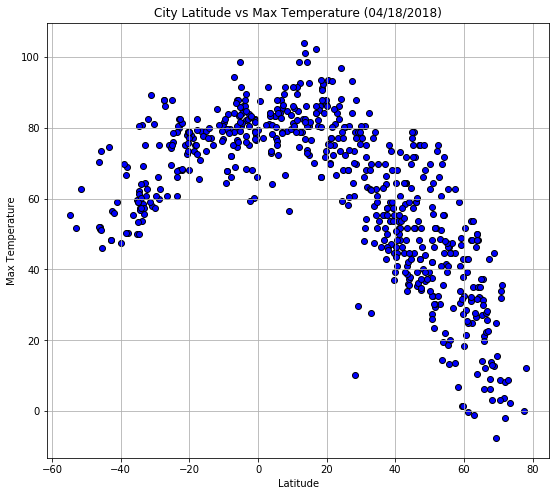
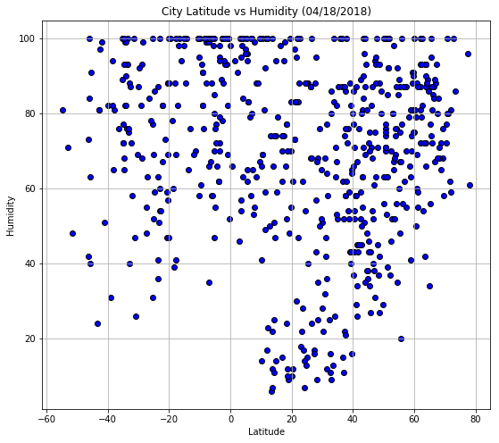
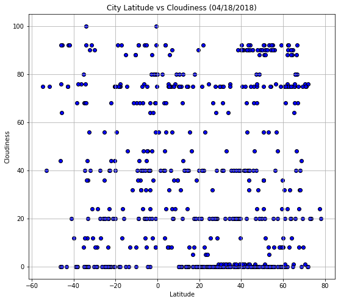
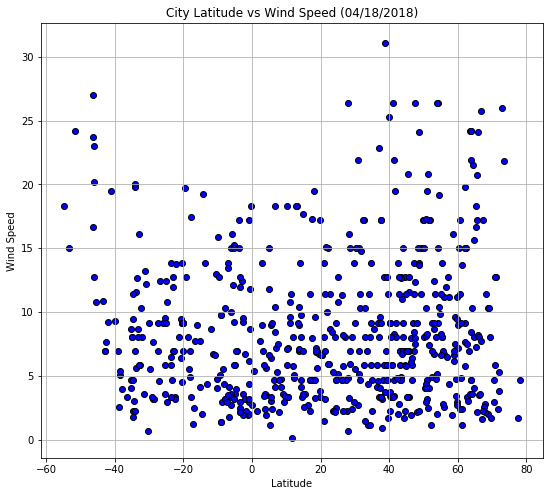

1. There is a correlation between a cites latitude and their max temperature. 
2. There is no correlation between a cites wind speed and their max temperature. 
3. There is no correlation between a cites clouidness and their max temperature. 


```python
!pip install citipy
import random
from citipy import citipy
import matplotlib.pyplot as plt
import openweathermapy as owm
import pandas as pd
import numpy as np
from random import randint
from config import api_key
import requests
import urllib.parse
from datetime import datetime, timedelta


```

    Requirement already satisfied: citipy in c:\users\ryan2\anaconda3\envs\pythondata\lib\site-packages
    Requirement already satisfied: kdtree>=0.12 in c:\users\ryan2\anaconda3\envs\pythondata\lib\site-packages (from citipy)
    

    You are using pip version 9.0.1, however version 9.0.3 is available.
    You should consider upgrading via the 'python -m pip install --upgrade pip' command.
    


```python
#-90 to 90 and -180 to 180
cities = pd.DataFrame()

cities["Latitude"] = ''
cities["Longitude"] = ''
cities["City"] = ''
cities["Country Code"] = ''


cities["Latitude"] = [np.random.uniform(-90,90) for x in range(1700)]
cities["Longitude"] = [np.random.uniform(-180, 180) for x in range(1700)]

for index, row in cities.iterrows():
    lat = row['Latitude']
    lng = row['Longitude']
    cities.set_value(index, 'City', citipy.nearest_city(lat, lng).city_name)
    cities.set_value(index, 'Country Code', citipy.nearest_city(lat, lng).country_code)
    
cities = cities.drop_duplicates(['City'], keep='first')
cities.reset_index(drop=True, inplace=True)
cities.to_csv('Cities_from_Citipy.csv', index=False)
```

    C:\Users\ryan2\Anaconda3\envs\PythonData\lib\site-packages\ipykernel_launcher.py:16: FutureWarning: set_value is deprecated and will be removed in a future release. Please use .at[] or .iat[] accessors instead
      app.launch_new_instance()
    C:\Users\ryan2\Anaconda3\envs\PythonData\lib\site-packages\ipykernel_launcher.py:17: FutureWarning: set_value is deprecated and will be removed in a future release. Please use .at[] or .iat[] accessors instead
    


```python
city_list = cities.loc[:, "City"]
```


```python
url = "http://api.openweathermap.org/data/2.5/weather?"
units = "imperial"

search_url = url + "appid=" + api_key + "&units=" + units + "&q="

response_data = []
counter = 0

for city in city_list:
    response = requests.get(search_url + city).json()
    counter += 1
    print(f"Processing record {counter} | {city}") 
     
    if response.get("id"):
        response_data.append(response)
        print (search_url + (urllib.parse.quote(city, safe='')))
             
    else:
        print(f"OpenWeatherMap did not have any weather data for {city}")

```

    Processing record 1 | ushuaia
    http://api.openweathermap.org/data/2.5/weather?appid=fcc899e9c8c00d47dfbee9c171ea2916&units=imperial&q=ushuaia
    Processing record 2 | boca do acre
    http://api.openweathermap.org/data/2.5/weather?appid=fcc899e9c8c00d47dfbee9c171ea2916&units=imperial&q=boca%20do%20acre
    Processing record 3 | chokurdakh
    http://api.openweathermap.org/data/2.5/weather?appid=fcc899e9c8c00d47dfbee9c171ea2916&units=imperial&q=chokurdakh
    Processing record 4 | dikson
    http://api.openweathermap.org/data/2.5/weather?appid=fcc899e9c8c00d47dfbee9c171ea2916&units=imperial&q=dikson
    Processing record 5 | barrow
    http://api.openweathermap.org/data/2.5/weather?appid=fcc899e9c8c00d47dfbee9c171ea2916&units=imperial&q=barrow
    Processing record 6 | lata
    http://api.openweathermap.org/data/2.5/weather?appid=fcc899e9c8c00d47dfbee9c171ea2916&units=imperial&q=lata
    Processing record 7 | saldanha
    http://api.openweathermap.org/data/2.5/weather?appid=fcc899e9c8c00d47dfbee9c171ea2916&units=imperial&q=saldanha
    Processing record 8 | port alfred
    http://api.openweathermap.org/data/2.5/weather?appid=fcc899e9c8c00d47dfbee9c171ea2916&units=imperial&q=port%20alfred
    Processing record 9 | los llanos de aridane
    http://api.openweathermap.org/data/2.5/weather?appid=fcc899e9c8c00d47dfbee9c171ea2916&units=imperial&q=los%20llanos%20de%20aridane
    Processing record 10 | castro
    http://api.openweathermap.org/data/2.5/weather?appid=fcc899e9c8c00d47dfbee9c171ea2916&units=imperial&q=castro
    Processing record 11 | padang
    http://api.openweathermap.org/data/2.5/weather?appid=fcc899e9c8c00d47dfbee9c171ea2916&units=imperial&q=padang
    Processing record 12 | jamestown
    http://api.openweathermap.org/data/2.5/weather?appid=fcc899e9c8c00d47dfbee9c171ea2916&units=imperial&q=jamestown
    Processing record 13 | rikitea
    http://api.openweathermap.org/data/2.5/weather?appid=fcc899e9c8c00d47dfbee9c171ea2916&units=imperial&q=rikitea
    Processing record 14 | puerto ayora
    http://api.openweathermap.org/data/2.5/weather?appid=fcc899e9c8c00d47dfbee9c171ea2916&units=imperial&q=puerto%20ayora
    Processing record 15 | katsuura
    http://api.openweathermap.org/data/2.5/weather?appid=fcc899e9c8c00d47dfbee9c171ea2916&units=imperial&q=katsuura
    Processing record 16 | athabasca
    http://api.openweathermap.org/data/2.5/weather?appid=fcc899e9c8c00d47dfbee9c171ea2916&units=imperial&q=athabasca
    Processing record 17 | trincomalee
    http://api.openweathermap.org/data/2.5/weather?appid=fcc899e9c8c00d47dfbee9c171ea2916&units=imperial&q=trincomalee
    Processing record 18 | ballina
    http://api.openweathermap.org/data/2.5/weather?appid=fcc899e9c8c00d47dfbee9c171ea2916&units=imperial&q=ballina
    Processing record 19 | bredasdorp
    http://api.openweathermap.org/data/2.5/weather?appid=fcc899e9c8c00d47dfbee9c171ea2916&units=imperial&q=bredasdorp
    Processing record 20 | busselton
    http://api.openweathermap.org/data/2.5/weather?appid=fcc899e9c8c00d47dfbee9c171ea2916&units=imperial&q=busselton
    Processing record 21 | iqaluit
    http://api.openweathermap.org/data/2.5/weather?appid=fcc899e9c8c00d47dfbee9c171ea2916&units=imperial&q=iqaluit
    Processing record 22 | mar del plata
    http://api.openweathermap.org/data/2.5/weather?appid=fcc899e9c8c00d47dfbee9c171ea2916&units=imperial&q=mar%20del%20plata
    Processing record 23 | petropavlovka
    http://api.openweathermap.org/data/2.5/weather?appid=fcc899e9c8c00d47dfbee9c171ea2916&units=imperial&q=petropavlovka
    Processing record 24 | scottsburgh
    OpenWeatherMap did not have any weather data for scottsburgh
    Processing record 25 | lompoc
    http://api.openweathermap.org/data/2.5/weather?appid=fcc899e9c8c00d47dfbee9c171ea2916&units=imperial&q=lompoc
    Processing record 26 | bismarck
    http://api.openweathermap.org/data/2.5/weather?appid=fcc899e9c8c00d47dfbee9c171ea2916&units=imperial&q=bismarck
    Processing record 27 | vaini
    http://api.openweathermap.org/data/2.5/weather?appid=fcc899e9c8c00d47dfbee9c171ea2916&units=imperial&q=vaini
    Processing record 28 | atuona
    http://api.openweathermap.org/data/2.5/weather?appid=fcc899e9c8c00d47dfbee9c171ea2916&units=imperial&q=atuona
    Processing record 29 | new norfolk
    http://api.openweathermap.org/data/2.5/weather?appid=fcc899e9c8c00d47dfbee9c171ea2916&units=imperial&q=new%20norfolk
    Processing record 30 | ormara
    http://api.openweathermap.org/data/2.5/weather?appid=fcc899e9c8c00d47dfbee9c171ea2916&units=imperial&q=ormara
    Processing record 31 | petropavlovsk-kamchatskiy
    http://api.openweathermap.org/data/2.5/weather?appid=fcc899e9c8c00d47dfbee9c171ea2916&units=imperial&q=petropavlovsk-kamchatskiy
    Processing record 32 | georgetown
    http://api.openweathermap.org/data/2.5/weather?appid=fcc899e9c8c00d47dfbee9c171ea2916&units=imperial&q=georgetown
    Processing record 33 | skibbereen
    http://api.openweathermap.org/data/2.5/weather?appid=fcc899e9c8c00d47dfbee9c171ea2916&units=imperial&q=skibbereen
    Processing record 34 | alexandria
    http://api.openweathermap.org/data/2.5/weather?appid=fcc899e9c8c00d47dfbee9c171ea2916&units=imperial&q=alexandria
    Processing record 35 | khatanga
    http://api.openweathermap.org/data/2.5/weather?appid=fcc899e9c8c00d47dfbee9c171ea2916&units=imperial&q=khatanga
    Processing record 36 | poum
    http://api.openweathermap.org/data/2.5/weather?appid=fcc899e9c8c00d47dfbee9c171ea2916&units=imperial&q=poum
    Processing record 37 | salalah
    http://api.openweathermap.org/data/2.5/weather?appid=fcc899e9c8c00d47dfbee9c171ea2916&units=imperial&q=salalah
    Processing record 38 | tasiilaq
    http://api.openweathermap.org/data/2.5/weather?appid=fcc899e9c8c00d47dfbee9c171ea2916&units=imperial&q=tasiilaq
    Processing record 39 | butaritari
    http://api.openweathermap.org/data/2.5/weather?appid=fcc899e9c8c00d47dfbee9c171ea2916&units=imperial&q=butaritari
    Processing record 40 | nome
    http://api.openweathermap.org/data/2.5/weather?appid=fcc899e9c8c00d47dfbee9c171ea2916&units=imperial&q=nome
    Processing record 41 | port blair
    http://api.openweathermap.org/data/2.5/weather?appid=fcc899e9c8c00d47dfbee9c171ea2916&units=imperial&q=port%20blair
    Processing record 42 | hilo
    http://api.openweathermap.org/data/2.5/weather?appid=fcc899e9c8c00d47dfbee9c171ea2916&units=imperial&q=hilo
    Processing record 43 | amderma
    OpenWeatherMap did not have any weather data for amderma
    Processing record 44 | saquena
    http://api.openweathermap.org/data/2.5/weather?appid=fcc899e9c8c00d47dfbee9c171ea2916&units=imperial&q=saquena
    Processing record 45 | hermanus
    http://api.openweathermap.org/data/2.5/weather?appid=fcc899e9c8c00d47dfbee9c171ea2916&units=imperial&q=hermanus
    Processing record 46 | kodiak
    http://api.openweathermap.org/data/2.5/weather?appid=fcc899e9c8c00d47dfbee9c171ea2916&units=imperial&q=kodiak
    Processing record 47 | mocuba
    http://api.openweathermap.org/data/2.5/weather?appid=fcc899e9c8c00d47dfbee9c171ea2916&units=imperial&q=mocuba
    Processing record 48 | aswan
    http://api.openweathermap.org/data/2.5/weather?appid=fcc899e9c8c00d47dfbee9c171ea2916&units=imperial&q=aswan
    Processing record 49 | te anau
    http://api.openweathermap.org/data/2.5/weather?appid=fcc899e9c8c00d47dfbee9c171ea2916&units=imperial&q=te%20anau
    Processing record 50 | noumea
    http://api.openweathermap.org/data/2.5/weather?appid=fcc899e9c8c00d47dfbee9c171ea2916&units=imperial&q=noumea
    Processing record 51 | arraial do cabo
    http://api.openweathermap.org/data/2.5/weather?appid=fcc899e9c8c00d47dfbee9c171ea2916&units=imperial&q=arraial%20do%20cabo
    Processing record 52 | nikolskoye
    http://api.openweathermap.org/data/2.5/weather?appid=fcc899e9c8c00d47dfbee9c171ea2916&units=imperial&q=nikolskoye
    Processing record 53 | codrington
    http://api.openweathermap.org/data/2.5/weather?appid=fcc899e9c8c00d47dfbee9c171ea2916&units=imperial&q=codrington
    Processing record 54 | itoman
    http://api.openweathermap.org/data/2.5/weather?appid=fcc899e9c8c00d47dfbee9c171ea2916&units=imperial&q=itoman
    Processing record 55 | ribeira grande
    http://api.openweathermap.org/data/2.5/weather?appid=fcc899e9c8c00d47dfbee9c171ea2916&units=imperial&q=ribeira%20grande
    Processing record 56 | yellowknife
    http://api.openweathermap.org/data/2.5/weather?appid=fcc899e9c8c00d47dfbee9c171ea2916&units=imperial&q=yellowknife
    Processing record 57 | reserva
    http://api.openweathermap.org/data/2.5/weather?appid=fcc899e9c8c00d47dfbee9c171ea2916&units=imperial&q=reserva
    Processing record 58 | belmonte
    http://api.openweathermap.org/data/2.5/weather?appid=fcc899e9c8c00d47dfbee9c171ea2916&units=imperial&q=belmonte
    Processing record 59 | nago
    http://api.openweathermap.org/data/2.5/weather?appid=fcc899e9c8c00d47dfbee9c171ea2916&units=imperial&q=nago
    Processing record 60 | paamiut
    http://api.openweathermap.org/data/2.5/weather?appid=fcc899e9c8c00d47dfbee9c171ea2916&units=imperial&q=paamiut
    Processing record 61 | barentsburg
    OpenWeatherMap did not have any weather data for barentsburg
    Processing record 62 | albany
    http://api.openweathermap.org/data/2.5/weather?appid=fcc899e9c8c00d47dfbee9c171ea2916&units=imperial&q=albany
    Processing record 63 | fortuna
    http://api.openweathermap.org/data/2.5/weather?appid=fcc899e9c8c00d47dfbee9c171ea2916&units=imperial&q=fortuna
    Processing record 64 | vestmannaeyjar
    http://api.openweathermap.org/data/2.5/weather?appid=fcc899e9c8c00d47dfbee9c171ea2916&units=imperial&q=vestmannaeyjar
    Processing record 65 | east london
    http://api.openweathermap.org/data/2.5/weather?appid=fcc899e9c8c00d47dfbee9c171ea2916&units=imperial&q=east%20london
    Processing record 66 | punta arenas
    http://api.openweathermap.org/data/2.5/weather?appid=fcc899e9c8c00d47dfbee9c171ea2916&units=imperial&q=punta%20arenas
    Processing record 67 | arlit
    http://api.openweathermap.org/data/2.5/weather?appid=fcc899e9c8c00d47dfbee9c171ea2916&units=imperial&q=arlit
    Processing record 68 | oranjemund
    http://api.openweathermap.org/data/2.5/weather?appid=fcc899e9c8c00d47dfbee9c171ea2916&units=imperial&q=oranjemund
    Processing record 69 | dhidhdhoo
    http://api.openweathermap.org/data/2.5/weather?appid=fcc899e9c8c00d47dfbee9c171ea2916&units=imperial&q=dhidhdhoo
    Processing record 70 | berdigestyakh
    http://api.openweathermap.org/data/2.5/weather?appid=fcc899e9c8c00d47dfbee9c171ea2916&units=imperial&q=berdigestyakh
    Processing record 71 | mariinskiy posad
    http://api.openweathermap.org/data/2.5/weather?appid=fcc899e9c8c00d47dfbee9c171ea2916&units=imperial&q=mariinskiy%20posad
    Processing record 72 | kano
    http://api.openweathermap.org/data/2.5/weather?appid=fcc899e9c8c00d47dfbee9c171ea2916&units=imperial&q=kano
    Processing record 73 | college
    http://api.openweathermap.org/data/2.5/weather?appid=fcc899e9c8c00d47dfbee9c171ea2916&units=imperial&q=college
    Processing record 74 | pontianak
    http://api.openweathermap.org/data/2.5/weather?appid=fcc899e9c8c00d47dfbee9c171ea2916&units=imperial&q=pontianak
    Processing record 75 | hofn
    http://api.openweathermap.org/data/2.5/weather?appid=fcc899e9c8c00d47dfbee9c171ea2916&units=imperial&q=hofn
    Processing record 76 | qaanaaq
    http://api.openweathermap.org/data/2.5/weather?appid=fcc899e9c8c00d47dfbee9c171ea2916&units=imperial&q=qaanaaq
    Processing record 77 | kinkala
    http://api.openweathermap.org/data/2.5/weather?appid=fcc899e9c8c00d47dfbee9c171ea2916&units=imperial&q=kinkala
    Processing record 78 | capoterra
    http://api.openweathermap.org/data/2.5/weather?appid=fcc899e9c8c00d47dfbee9c171ea2916&units=imperial&q=capoterra
    Processing record 79 | barawe
    OpenWeatherMap did not have any weather data for barawe
    Processing record 80 | mataura
    http://api.openweathermap.org/data/2.5/weather?appid=fcc899e9c8c00d47dfbee9c171ea2916&units=imperial&q=mataura
    Processing record 81 | bereda
    http://api.openweathermap.org/data/2.5/weather?appid=fcc899e9c8c00d47dfbee9c171ea2916&units=imperial&q=bereda
    Processing record 82 | hithadhoo
    http://api.openweathermap.org/data/2.5/weather?appid=fcc899e9c8c00d47dfbee9c171ea2916&units=imperial&q=hithadhoo
    Processing record 83 | auki
    http://api.openweathermap.org/data/2.5/weather?appid=fcc899e9c8c00d47dfbee9c171ea2916&units=imperial&q=auki
    Processing record 84 | motala
    http://api.openweathermap.org/data/2.5/weather?appid=fcc899e9c8c00d47dfbee9c171ea2916&units=imperial&q=motala
    Processing record 85 | black river
    http://api.openweathermap.org/data/2.5/weather?appid=fcc899e9c8c00d47dfbee9c171ea2916&units=imperial&q=black%20river
    Processing record 86 | mersing
    http://api.openweathermap.org/data/2.5/weather?appid=fcc899e9c8c00d47dfbee9c171ea2916&units=imperial&q=mersing
    Processing record 87 | bathsheba
    http://api.openweathermap.org/data/2.5/weather?appid=fcc899e9c8c00d47dfbee9c171ea2916&units=imperial&q=bathsheba
    Processing record 88 | faanui
    http://api.openweathermap.org/data/2.5/weather?appid=fcc899e9c8c00d47dfbee9c171ea2916&units=imperial&q=faanui
    Processing record 89 | sitka
    http://api.openweathermap.org/data/2.5/weather?appid=fcc899e9c8c00d47dfbee9c171ea2916&units=imperial&q=sitka
    Processing record 90 | arkadelphia
    http://api.openweathermap.org/data/2.5/weather?appid=fcc899e9c8c00d47dfbee9c171ea2916&units=imperial&q=arkadelphia
    Processing record 91 | beira
    http://api.openweathermap.org/data/2.5/weather?appid=fcc899e9c8c00d47dfbee9c171ea2916&units=imperial&q=beira
    Processing record 92 | thompson
    http://api.openweathermap.org/data/2.5/weather?appid=fcc899e9c8c00d47dfbee9c171ea2916&units=imperial&q=thompson
    Processing record 93 | atka
    OpenWeatherMap did not have any weather data for atka
    Processing record 94 | januaria
    OpenWeatherMap did not have any weather data for januaria
    Processing record 95 | cabrera
    http://api.openweathermap.org/data/2.5/weather?appid=fcc899e9c8c00d47dfbee9c171ea2916&units=imperial&q=cabrera
    Processing record 96 | carnarvon
    http://api.openweathermap.org/data/2.5/weather?appid=fcc899e9c8c00d47dfbee9c171ea2916&units=imperial&q=carnarvon
    Processing record 97 | iracoubo
    http://api.openweathermap.org/data/2.5/weather?appid=fcc899e9c8c00d47dfbee9c171ea2916&units=imperial&q=iracoubo
    Processing record 98 | taolanaro
    OpenWeatherMap did not have any weather data for taolanaro
    Processing record 99 | abha
    http://api.openweathermap.org/data/2.5/weather?appid=fcc899e9c8c00d47dfbee9c171ea2916&units=imperial&q=abha
    Processing record 100 | muisne
    http://api.openweathermap.org/data/2.5/weather?appid=fcc899e9c8c00d47dfbee9c171ea2916&units=imperial&q=muisne
    Processing record 101 | abbeville
    http://api.openweathermap.org/data/2.5/weather?appid=fcc899e9c8c00d47dfbee9c171ea2916&units=imperial&q=abbeville
    Processing record 102 | alofi
    http://api.openweathermap.org/data/2.5/weather?appid=fcc899e9c8c00d47dfbee9c171ea2916&units=imperial&q=alofi
    Processing record 103 | kantabanji
    http://api.openweathermap.org/data/2.5/weather?appid=fcc899e9c8c00d47dfbee9c171ea2916&units=imperial&q=kantabanji
    Processing record 104 | tiksi
    http://api.openweathermap.org/data/2.5/weather?appid=fcc899e9c8c00d47dfbee9c171ea2916&units=imperial&q=tiksi
    Processing record 105 | port macquarie
    http://api.openweathermap.org/data/2.5/weather?appid=fcc899e9c8c00d47dfbee9c171ea2916&units=imperial&q=port%20macquarie
    Processing record 106 | toftir
    OpenWeatherMap did not have any weather data for toftir
    Processing record 107 | upernavik
    http://api.openweathermap.org/data/2.5/weather?appid=fcc899e9c8c00d47dfbee9c171ea2916&units=imperial&q=upernavik
    Processing record 108 | tsihombe
    OpenWeatherMap did not have any weather data for tsihombe
    Processing record 109 | hyeres
    http://api.openweathermap.org/data/2.5/weather?appid=fcc899e9c8c00d47dfbee9c171ea2916&units=imperial&q=hyeres
    Processing record 110 | nabire
    http://api.openweathermap.org/data/2.5/weather?appid=fcc899e9c8c00d47dfbee9c171ea2916&units=imperial&q=nabire
    Processing record 111 | geraldton
    http://api.openweathermap.org/data/2.5/weather?appid=fcc899e9c8c00d47dfbee9c171ea2916&units=imperial&q=geraldton
    Processing record 112 | kapaa
    http://api.openweathermap.org/data/2.5/weather?appid=fcc899e9c8c00d47dfbee9c171ea2916&units=imperial&q=kapaa
    Processing record 113 | walvis bay
    http://api.openweathermap.org/data/2.5/weather?appid=fcc899e9c8c00d47dfbee9c171ea2916&units=imperial&q=walvis%20bay
    Processing record 114 | tuktoyaktuk
    http://api.openweathermap.org/data/2.5/weather?appid=fcc899e9c8c00d47dfbee9c171ea2916&units=imperial&q=tuktoyaktuk
    Processing record 115 | cape town
    http://api.openweathermap.org/data/2.5/weather?appid=fcc899e9c8c00d47dfbee9c171ea2916&units=imperial&q=cape%20town
    Processing record 116 | uruzgan
    http://api.openweathermap.org/data/2.5/weather?appid=fcc899e9c8c00d47dfbee9c171ea2916&units=imperial&q=uruzgan
    Processing record 117 | san ramon
    http://api.openweathermap.org/data/2.5/weather?appid=fcc899e9c8c00d47dfbee9c171ea2916&units=imperial&q=san%20ramon
    Processing record 118 | buariki
    OpenWeatherMap did not have any weather data for buariki
    Processing record 119 | srandakan
    http://api.openweathermap.org/data/2.5/weather?appid=fcc899e9c8c00d47dfbee9c171ea2916&units=imperial&q=srandakan
    Processing record 120 | lebu
    http://api.openweathermap.org/data/2.5/weather?appid=fcc899e9c8c00d47dfbee9c171ea2916&units=imperial&q=lebu
    Processing record 121 | tuatapere
    http://api.openweathermap.org/data/2.5/weather?appid=fcc899e9c8c00d47dfbee9c171ea2916&units=imperial&q=tuatapere
    Processing record 122 | nanortalik
    http://api.openweathermap.org/data/2.5/weather?appid=fcc899e9c8c00d47dfbee9c171ea2916&units=imperial&q=nanortalik
    Processing record 123 | victoria
    http://api.openweathermap.org/data/2.5/weather?appid=fcc899e9c8c00d47dfbee9c171ea2916&units=imperial&q=victoria
    Processing record 124 | eureka
    http://api.openweathermap.org/data/2.5/weather?appid=fcc899e9c8c00d47dfbee9c171ea2916&units=imperial&q=eureka
    Processing record 125 | saint-philippe
    http://api.openweathermap.org/data/2.5/weather?appid=fcc899e9c8c00d47dfbee9c171ea2916&units=imperial&q=saint-philippe
    Processing record 126 | kavaratti
    http://api.openweathermap.org/data/2.5/weather?appid=fcc899e9c8c00d47dfbee9c171ea2916&units=imperial&q=kavaratti
    Processing record 127 | berlevag
    http://api.openweathermap.org/data/2.5/weather?appid=fcc899e9c8c00d47dfbee9c171ea2916&units=imperial&q=berlevag
    Processing record 128 | corrientes
    http://api.openweathermap.org/data/2.5/weather?appid=fcc899e9c8c00d47dfbee9c171ea2916&units=imperial&q=corrientes
    Processing record 129 | zaranj
    http://api.openweathermap.org/data/2.5/weather?appid=fcc899e9c8c00d47dfbee9c171ea2916&units=imperial&q=zaranj
    Processing record 130 | mahebourg
    http://api.openweathermap.org/data/2.5/weather?appid=fcc899e9c8c00d47dfbee9c171ea2916&units=imperial&q=mahebourg
    Processing record 131 | san carlos de bariloche
    http://api.openweathermap.org/data/2.5/weather?appid=fcc899e9c8c00d47dfbee9c171ea2916&units=imperial&q=san%20carlos%20de%20bariloche
    Processing record 132 | nantucket
    http://api.openweathermap.org/data/2.5/weather?appid=fcc899e9c8c00d47dfbee9c171ea2916&units=imperial&q=nantucket
    Processing record 133 | anadyr
    http://api.openweathermap.org/data/2.5/weather?appid=fcc899e9c8c00d47dfbee9c171ea2916&units=imperial&q=anadyr
    Processing record 134 | goderich
    http://api.openweathermap.org/data/2.5/weather?appid=fcc899e9c8c00d47dfbee9c171ea2916&units=imperial&q=goderich
    Processing record 135 | buala
    http://api.openweathermap.org/data/2.5/weather?appid=fcc899e9c8c00d47dfbee9c171ea2916&units=imperial&q=buala
    Processing record 136 | kamenka
    http://api.openweathermap.org/data/2.5/weather?appid=fcc899e9c8c00d47dfbee9c171ea2916&units=imperial&q=kamenka
    Processing record 137 | sacramento
    http://api.openweathermap.org/data/2.5/weather?appid=fcc899e9c8c00d47dfbee9c171ea2916&units=imperial&q=sacramento
    Processing record 138 | yakima
    http://api.openweathermap.org/data/2.5/weather?appid=fcc899e9c8c00d47dfbee9c171ea2916&units=imperial&q=yakima
    Processing record 139 | kupang
    http://api.openweathermap.org/data/2.5/weather?appid=fcc899e9c8c00d47dfbee9c171ea2916&units=imperial&q=kupang
    Processing record 140 | babstovo
    http://api.openweathermap.org/data/2.5/weather?appid=fcc899e9c8c00d47dfbee9c171ea2916&units=imperial&q=babstovo
    Processing record 141 | dauphin
    http://api.openweathermap.org/data/2.5/weather?appid=fcc899e9c8c00d47dfbee9c171ea2916&units=imperial&q=dauphin
    Processing record 142 | pacific grove
    http://api.openweathermap.org/data/2.5/weather?appid=fcc899e9c8c00d47dfbee9c171ea2916&units=imperial&q=pacific%20grove
    Processing record 143 | bluff
    http://api.openweathermap.org/data/2.5/weather?appid=fcc899e9c8c00d47dfbee9c171ea2916&units=imperial&q=bluff
    Processing record 144 | great yarmouth
    http://api.openweathermap.org/data/2.5/weather?appid=fcc899e9c8c00d47dfbee9c171ea2916&units=imperial&q=great%20yarmouth
    Processing record 145 | saint george
    http://api.openweathermap.org/data/2.5/weather?appid=fcc899e9c8c00d47dfbee9c171ea2916&units=imperial&q=saint%20george
    Processing record 146 | scarborough
    http://api.openweathermap.org/data/2.5/weather?appid=fcc899e9c8c00d47dfbee9c171ea2916&units=imperial&q=scarborough
    Processing record 147 | anshun
    http://api.openweathermap.org/data/2.5/weather?appid=fcc899e9c8c00d47dfbee9c171ea2916&units=imperial&q=anshun
    Processing record 148 | araouane
    http://api.openweathermap.org/data/2.5/weather?appid=fcc899e9c8c00d47dfbee9c171ea2916&units=imperial&q=araouane
    Processing record 149 | sur
    http://api.openweathermap.org/data/2.5/weather?appid=fcc899e9c8c00d47dfbee9c171ea2916&units=imperial&q=sur
    Processing record 150 | alice springs
    http://api.openweathermap.org/data/2.5/weather?appid=fcc899e9c8c00d47dfbee9c171ea2916&units=imperial&q=alice%20springs
    Processing record 151 | lagoa
    http://api.openweathermap.org/data/2.5/weather?appid=fcc899e9c8c00d47dfbee9c171ea2916&units=imperial&q=lagoa
    Processing record 152 | provideniya
    http://api.openweathermap.org/data/2.5/weather?appid=fcc899e9c8c00d47dfbee9c171ea2916&units=imperial&q=provideniya
    Processing record 153 | umzimvubu
    OpenWeatherMap did not have any weather data for umzimvubu
    Processing record 154 | ponta do sol
    http://api.openweathermap.org/data/2.5/weather?appid=fcc899e9c8c00d47dfbee9c171ea2916&units=imperial&q=ponta%20do%20sol
    Processing record 155 | ostrov
    http://api.openweathermap.org/data/2.5/weather?appid=fcc899e9c8c00d47dfbee9c171ea2916&units=imperial&q=ostrov
    Processing record 156 | raudeberg
    http://api.openweathermap.org/data/2.5/weather?appid=fcc899e9c8c00d47dfbee9c171ea2916&units=imperial&q=raudeberg
    Processing record 157 | nalut
    http://api.openweathermap.org/data/2.5/weather?appid=fcc899e9c8c00d47dfbee9c171ea2916&units=imperial&q=nalut
    Processing record 158 | vostok
    http://api.openweathermap.org/data/2.5/weather?appid=fcc899e9c8c00d47dfbee9c171ea2916&units=imperial&q=vostok
    Processing record 159 | nigde
    http://api.openweathermap.org/data/2.5/weather?appid=fcc899e9c8c00d47dfbee9c171ea2916&units=imperial&q=nigde
    Processing record 160 | yulara
    http://api.openweathermap.org/data/2.5/weather?appid=fcc899e9c8c00d47dfbee9c171ea2916&units=imperial&q=yulara
    Processing record 161 | taltal
    http://api.openweathermap.org/data/2.5/weather?appid=fcc899e9c8c00d47dfbee9c171ea2916&units=imperial&q=taltal
    Processing record 162 | roseburg
    http://api.openweathermap.org/data/2.5/weather?appid=fcc899e9c8c00d47dfbee9c171ea2916&units=imperial&q=roseburg
    Processing record 163 | shebalino
    http://api.openweathermap.org/data/2.5/weather?appid=fcc899e9c8c00d47dfbee9c171ea2916&units=imperial&q=shebalino
    Processing record 164 | port elizabeth
    http://api.openweathermap.org/data/2.5/weather?appid=fcc899e9c8c00d47dfbee9c171ea2916&units=imperial&q=port%20elizabeth
    Processing record 165 | ancud
    http://api.openweathermap.org/data/2.5/weather?appid=fcc899e9c8c00d47dfbee9c171ea2916&units=imperial&q=ancud
    Processing record 166 | karratha
    http://api.openweathermap.org/data/2.5/weather?appid=fcc899e9c8c00d47dfbee9c171ea2916&units=imperial&q=karratha
    Processing record 167 | hasaki
    http://api.openweathermap.org/data/2.5/weather?appid=fcc899e9c8c00d47dfbee9c171ea2916&units=imperial&q=hasaki
    Processing record 168 | husavik
    http://api.openweathermap.org/data/2.5/weather?appid=fcc899e9c8c00d47dfbee9c171ea2916&units=imperial&q=husavik
    Processing record 169 | mys shmidta
    OpenWeatherMap did not have any weather data for mys shmidta
    Processing record 170 | aykhal
    http://api.openweathermap.org/data/2.5/weather?appid=fcc899e9c8c00d47dfbee9c171ea2916&units=imperial&q=aykhal
    Processing record 171 | matagami
    http://api.openweathermap.org/data/2.5/weather?appid=fcc899e9c8c00d47dfbee9c171ea2916&units=imperial&q=matagami
    Processing record 172 | vao
    http://api.openweathermap.org/data/2.5/weather?appid=fcc899e9c8c00d47dfbee9c171ea2916&units=imperial&q=vao
    Processing record 173 | nelson bay
    http://api.openweathermap.org/data/2.5/weather?appid=fcc899e9c8c00d47dfbee9c171ea2916&units=imperial&q=nelson%20bay
    Processing record 174 | egvekinot
    http://api.openweathermap.org/data/2.5/weather?appid=fcc899e9c8c00d47dfbee9c171ea2916&units=imperial&q=egvekinot
    Processing record 175 | san policarpo
    http://api.openweathermap.org/data/2.5/weather?appid=fcc899e9c8c00d47dfbee9c171ea2916&units=imperial&q=san%20policarpo
    Processing record 176 | belushya guba
    OpenWeatherMap did not have any weather data for belushya guba
    Processing record 177 | yuzhno-yeniseyskiy
    OpenWeatherMap did not have any weather data for yuzhno-yeniseyskiy
    Processing record 178 | souillac
    http://api.openweathermap.org/data/2.5/weather?appid=fcc899e9c8c00d47dfbee9c171ea2916&units=imperial&q=souillac
    Processing record 179 | ponta delgada
    http://api.openweathermap.org/data/2.5/weather?appid=fcc899e9c8c00d47dfbee9c171ea2916&units=imperial&q=ponta%20delgada
    Processing record 180 | panjakent
    http://api.openweathermap.org/data/2.5/weather?appid=fcc899e9c8c00d47dfbee9c171ea2916&units=imperial&q=panjakent
    Processing record 181 | mweka
    http://api.openweathermap.org/data/2.5/weather?appid=fcc899e9c8c00d47dfbee9c171ea2916&units=imperial&q=mweka
    Processing record 182 | cherskiy
    http://api.openweathermap.org/data/2.5/weather?appid=fcc899e9c8c00d47dfbee9c171ea2916&units=imperial&q=cherskiy
    Processing record 183 | tautira
    http://api.openweathermap.org/data/2.5/weather?appid=fcc899e9c8c00d47dfbee9c171ea2916&units=imperial&q=tautira
    Processing record 184 | andenes
    OpenWeatherMap did not have any weather data for andenes
    Processing record 185 | kamogawa
    http://api.openweathermap.org/data/2.5/weather?appid=fcc899e9c8c00d47dfbee9c171ea2916&units=imperial&q=kamogawa
    Processing record 186 | chauk
    http://api.openweathermap.org/data/2.5/weather?appid=fcc899e9c8c00d47dfbee9c171ea2916&units=imperial&q=chauk
    Processing record 187 | cabo san lucas
    http://api.openweathermap.org/data/2.5/weather?appid=fcc899e9c8c00d47dfbee9c171ea2916&units=imperial&q=cabo%20san%20lucas
    Processing record 188 | masuguru
    http://api.openweathermap.org/data/2.5/weather?appid=fcc899e9c8c00d47dfbee9c171ea2916&units=imperial&q=masuguru
    Processing record 189 | sisimiut
    http://api.openweathermap.org/data/2.5/weather?appid=fcc899e9c8c00d47dfbee9c171ea2916&units=imperial&q=sisimiut
    Processing record 190 | uwayl
    OpenWeatherMap did not have any weather data for uwayl
    Processing record 191 | kaeo
    http://api.openweathermap.org/data/2.5/weather?appid=fcc899e9c8c00d47dfbee9c171ea2916&units=imperial&q=kaeo
    Processing record 192 | taitung
    http://api.openweathermap.org/data/2.5/weather?appid=fcc899e9c8c00d47dfbee9c171ea2916&units=imperial&q=taitung
    Processing record 193 | isangel
    http://api.openweathermap.org/data/2.5/weather?appid=fcc899e9c8c00d47dfbee9c171ea2916&units=imperial&q=isangel
    Processing record 194 | chatellerault
    http://api.openweathermap.org/data/2.5/weather?appid=fcc899e9c8c00d47dfbee9c171ea2916&units=imperial&q=chatellerault
    Processing record 195 | huarmey
    http://api.openweathermap.org/data/2.5/weather?appid=fcc899e9c8c00d47dfbee9c171ea2916&units=imperial&q=huarmey
    Processing record 196 | tomatlan
    http://api.openweathermap.org/data/2.5/weather?appid=fcc899e9c8c00d47dfbee9c171ea2916&units=imperial&q=tomatlan
    Processing record 197 | magadan
    http://api.openweathermap.org/data/2.5/weather?appid=fcc899e9c8c00d47dfbee9c171ea2916&units=imperial&q=magadan
    Processing record 198 | bambous virieux
    http://api.openweathermap.org/data/2.5/weather?appid=fcc899e9c8c00d47dfbee9c171ea2916&units=imperial&q=bambous%20virieux
    Processing record 199 | hobart
    http://api.openweathermap.org/data/2.5/weather?appid=fcc899e9c8c00d47dfbee9c171ea2916&units=imperial&q=hobart
    Processing record 200 | north platte
    http://api.openweathermap.org/data/2.5/weather?appid=fcc899e9c8c00d47dfbee9c171ea2916&units=imperial&q=north%20platte
    Processing record 201 | kandrian
    http://api.openweathermap.org/data/2.5/weather?appid=fcc899e9c8c00d47dfbee9c171ea2916&units=imperial&q=kandrian
    Processing record 202 | saskylakh
    http://api.openweathermap.org/data/2.5/weather?appid=fcc899e9c8c00d47dfbee9c171ea2916&units=imperial&q=saskylakh
    Processing record 203 | artyom
    http://api.openweathermap.org/data/2.5/weather?appid=fcc899e9c8c00d47dfbee9c171ea2916&units=imperial&q=artyom
    Processing record 204 | severo-kurilsk
    http://api.openweathermap.org/data/2.5/weather?appid=fcc899e9c8c00d47dfbee9c171ea2916&units=imperial&q=severo-kurilsk
    Processing record 205 | jiuquan
    http://api.openweathermap.org/data/2.5/weather?appid=fcc899e9c8c00d47dfbee9c171ea2916&units=imperial&q=jiuquan
    Processing record 206 | lamesa
    http://api.openweathermap.org/data/2.5/weather?appid=fcc899e9c8c00d47dfbee9c171ea2916&units=imperial&q=lamesa
    Processing record 207 | bindura
    http://api.openweathermap.org/data/2.5/weather?appid=fcc899e9c8c00d47dfbee9c171ea2916&units=imperial&q=bindura
    Processing record 208 | novosil
    http://api.openweathermap.org/data/2.5/weather?appid=fcc899e9c8c00d47dfbee9c171ea2916&units=imperial&q=novosil
    Processing record 209 | roald
    http://api.openweathermap.org/data/2.5/weather?appid=fcc899e9c8c00d47dfbee9c171ea2916&units=imperial&q=roald
    Processing record 210 | aguimes
    http://api.openweathermap.org/data/2.5/weather?appid=fcc899e9c8c00d47dfbee9c171ea2916&units=imperial&q=aguimes
    Processing record 211 | samarai
    http://api.openweathermap.org/data/2.5/weather?appid=fcc899e9c8c00d47dfbee9c171ea2916&units=imperial&q=samarai
    Processing record 212 | londrina
    http://api.openweathermap.org/data/2.5/weather?appid=fcc899e9c8c00d47dfbee9c171ea2916&units=imperial&q=londrina
    Processing record 213 | cockburn town
    http://api.openweathermap.org/data/2.5/weather?appid=fcc899e9c8c00d47dfbee9c171ea2916&units=imperial&q=cockburn%20town
    Processing record 214 | grand river south east
    OpenWeatherMap did not have any weather data for grand river south east
    Processing record 215 | bengkulu
    OpenWeatherMap did not have any weather data for bengkulu
    Processing record 216 | namibe
    http://api.openweathermap.org/data/2.5/weather?appid=fcc899e9c8c00d47dfbee9c171ea2916&units=imperial&q=namibe
    Processing record 217 | narok
    http://api.openweathermap.org/data/2.5/weather?appid=fcc899e9c8c00d47dfbee9c171ea2916&units=imperial&q=narok
    Processing record 218 | maniitsoq
    http://api.openweathermap.org/data/2.5/weather?appid=fcc899e9c8c00d47dfbee9c171ea2916&units=imperial&q=maniitsoq
    Processing record 219 | avarua
    http://api.openweathermap.org/data/2.5/weather?appid=fcc899e9c8c00d47dfbee9c171ea2916&units=imperial&q=avarua
    Processing record 220 | lushunkou
    OpenWeatherMap did not have any weather data for lushunkou
    Processing record 221 | chuy
    http://api.openweathermap.org/data/2.5/weather?appid=fcc899e9c8c00d47dfbee9c171ea2916&units=imperial&q=chuy
    Processing record 222 | praia
    http://api.openweathermap.org/data/2.5/weather?appid=fcc899e9c8c00d47dfbee9c171ea2916&units=imperial&q=praia
    Processing record 223 | port hedland
    http://api.openweathermap.org/data/2.5/weather?appid=fcc899e9c8c00d47dfbee9c171ea2916&units=imperial&q=port%20hedland
    Processing record 224 | norman wells
    http://api.openweathermap.org/data/2.5/weather?appid=fcc899e9c8c00d47dfbee9c171ea2916&units=imperial&q=norman%20wells
    Processing record 225 | marystown
    http://api.openweathermap.org/data/2.5/weather?appid=fcc899e9c8c00d47dfbee9c171ea2916&units=imperial&q=marystown
    Processing record 226 | santa marta
    http://api.openweathermap.org/data/2.5/weather?appid=fcc899e9c8c00d47dfbee9c171ea2916&units=imperial&q=santa%20marta
    Processing record 227 | cidreira
    http://api.openweathermap.org/data/2.5/weather?appid=fcc899e9c8c00d47dfbee9c171ea2916&units=imperial&q=cidreira
    Processing record 228 | baie-comeau
    http://api.openweathermap.org/data/2.5/weather?appid=fcc899e9c8c00d47dfbee9c171ea2916&units=imperial&q=baie-comeau
    Processing record 229 | suez
    http://api.openweathermap.org/data/2.5/weather?appid=fcc899e9c8c00d47dfbee9c171ea2916&units=imperial&q=suez
    Processing record 230 | banda aceh
    http://api.openweathermap.org/data/2.5/weather?appid=fcc899e9c8c00d47dfbee9c171ea2916&units=imperial&q=banda%20aceh
    Processing record 231 | maridi
    OpenWeatherMap did not have any weather data for maridi
    Processing record 232 | shelburne
    http://api.openweathermap.org/data/2.5/weather?appid=fcc899e9c8c00d47dfbee9c171ea2916&units=imperial&q=shelburne
    Processing record 233 | sorong
    http://api.openweathermap.org/data/2.5/weather?appid=fcc899e9c8c00d47dfbee9c171ea2916&units=imperial&q=sorong
    Processing record 234 | bonavista
    http://api.openweathermap.org/data/2.5/weather?appid=fcc899e9c8c00d47dfbee9c171ea2916&units=imperial&q=bonavista
    Processing record 235 | north bend
    http://api.openweathermap.org/data/2.5/weather?appid=fcc899e9c8c00d47dfbee9c171ea2916&units=imperial&q=north%20bend
    Processing record 236 | bubaque
    http://api.openweathermap.org/data/2.5/weather?appid=fcc899e9c8c00d47dfbee9c171ea2916&units=imperial&q=bubaque
    Processing record 237 | esperance
    http://api.openweathermap.org/data/2.5/weather?appid=fcc899e9c8c00d47dfbee9c171ea2916&units=imperial&q=esperance
    Processing record 238 | balgazyn
    http://api.openweathermap.org/data/2.5/weather?appid=fcc899e9c8c00d47dfbee9c171ea2916&units=imperial&q=balgazyn
    Processing record 239 | susanville
    http://api.openweathermap.org/data/2.5/weather?appid=fcc899e9c8c00d47dfbee9c171ea2916&units=imperial&q=susanville
    Processing record 240 | pevek
    http://api.openweathermap.org/data/2.5/weather?appid=fcc899e9c8c00d47dfbee9c171ea2916&units=imperial&q=pevek
    Processing record 241 | makueni
    http://api.openweathermap.org/data/2.5/weather?appid=fcc899e9c8c00d47dfbee9c171ea2916&units=imperial&q=makueni
    Processing record 242 | nagato
    http://api.openweathermap.org/data/2.5/weather?appid=fcc899e9c8c00d47dfbee9c171ea2916&units=imperial&q=nagato
    Processing record 243 | qatana
    http://api.openweathermap.org/data/2.5/weather?appid=fcc899e9c8c00d47dfbee9c171ea2916&units=imperial&q=qatana
    Processing record 244 | teguldet
    http://api.openweathermap.org/data/2.5/weather?appid=fcc899e9c8c00d47dfbee9c171ea2916&units=imperial&q=teguldet
    Processing record 245 | illoqqortoormiut
    OpenWeatherMap did not have any weather data for illoqqortoormiut
    Processing record 246 | tezu
    http://api.openweathermap.org/data/2.5/weather?appid=fcc899e9c8c00d47dfbee9c171ea2916&units=imperial&q=tezu
    Processing record 247 | deer lake
    http://api.openweathermap.org/data/2.5/weather?appid=fcc899e9c8c00d47dfbee9c171ea2916&units=imperial&q=deer%20lake
    Processing record 248 | lagos
    http://api.openweathermap.org/data/2.5/weather?appid=fcc899e9c8c00d47dfbee9c171ea2916&units=imperial&q=lagos
    Processing record 249 | kahului
    http://api.openweathermap.org/data/2.5/weather?appid=fcc899e9c8c00d47dfbee9c171ea2916&units=imperial&q=kahului
    Processing record 250 | lazaro cardenas
    http://api.openweathermap.org/data/2.5/weather?appid=fcc899e9c8c00d47dfbee9c171ea2916&units=imperial&q=lazaro%20cardenas
    Processing record 251 | chicama
    http://api.openweathermap.org/data/2.5/weather?appid=fcc899e9c8c00d47dfbee9c171ea2916&units=imperial&q=chicama
    Processing record 252 | foumban
    http://api.openweathermap.org/data/2.5/weather?appid=fcc899e9c8c00d47dfbee9c171ea2916&units=imperial&q=foumban
    Processing record 253 | sohag
    http://api.openweathermap.org/data/2.5/weather?appid=fcc899e9c8c00d47dfbee9c171ea2916&units=imperial&q=sohag
    Processing record 254 | longyearbyen
    http://api.openweathermap.org/data/2.5/weather?appid=fcc899e9c8c00d47dfbee9c171ea2916&units=imperial&q=longyearbyen
    Processing record 255 | yarada
    http://api.openweathermap.org/data/2.5/weather?appid=fcc899e9c8c00d47dfbee9c171ea2916&units=imperial&q=yarada
    Processing record 256 | cabedelo
    http://api.openweathermap.org/data/2.5/weather?appid=fcc899e9c8c00d47dfbee9c171ea2916&units=imperial&q=cabedelo
    Processing record 257 | jumla
    http://api.openweathermap.org/data/2.5/weather?appid=fcc899e9c8c00d47dfbee9c171ea2916&units=imperial&q=jumla
    Processing record 258 | genhe
    http://api.openweathermap.org/data/2.5/weather?appid=fcc899e9c8c00d47dfbee9c171ea2916&units=imperial&q=genhe
    Processing record 259 | sjovegan
    http://api.openweathermap.org/data/2.5/weather?appid=fcc899e9c8c00d47dfbee9c171ea2916&units=imperial&q=sjovegan
    Processing record 260 | erenhot
    http://api.openweathermap.org/data/2.5/weather?appid=fcc899e9c8c00d47dfbee9c171ea2916&units=imperial&q=erenhot
    Processing record 261 | tommot
    http://api.openweathermap.org/data/2.5/weather?appid=fcc899e9c8c00d47dfbee9c171ea2916&units=imperial&q=tommot
    Processing record 262 | lavrentiya
    http://api.openweathermap.org/data/2.5/weather?appid=fcc899e9c8c00d47dfbee9c171ea2916&units=imperial&q=lavrentiya
    Processing record 263 | baraboo
    http://api.openweathermap.org/data/2.5/weather?appid=fcc899e9c8c00d47dfbee9c171ea2916&units=imperial&q=baraboo
    Processing record 264 | llangefni
    http://api.openweathermap.org/data/2.5/weather?appid=fcc899e9c8c00d47dfbee9c171ea2916&units=imperial&q=llangefni
    Processing record 265 | hami
    http://api.openweathermap.org/data/2.5/weather?appid=fcc899e9c8c00d47dfbee9c171ea2916&units=imperial&q=hami
    Processing record 266 | zirandaro
    http://api.openweathermap.org/data/2.5/weather?appid=fcc899e9c8c00d47dfbee9c171ea2916&units=imperial&q=zirandaro
    Processing record 267 | san quintin
    http://api.openweathermap.org/data/2.5/weather?appid=fcc899e9c8c00d47dfbee9c171ea2916&units=imperial&q=san%20quintin
    Processing record 268 | kavieng
    http://api.openweathermap.org/data/2.5/weather?appid=fcc899e9c8c00d47dfbee9c171ea2916&units=imperial&q=kavieng
    Processing record 269 | raton
    http://api.openweathermap.org/data/2.5/weather?appid=fcc899e9c8c00d47dfbee9c171ea2916&units=imperial&q=raton
    Processing record 270 | caravelas
    http://api.openweathermap.org/data/2.5/weather?appid=fcc899e9c8c00d47dfbee9c171ea2916&units=imperial&q=caravelas
    Processing record 271 | richards bay
    http://api.openweathermap.org/data/2.5/weather?appid=fcc899e9c8c00d47dfbee9c171ea2916&units=imperial&q=richards%20bay
    Processing record 272 | roxana
    http://api.openweathermap.org/data/2.5/weather?appid=fcc899e9c8c00d47dfbee9c171ea2916&units=imperial&q=roxana
    Processing record 273 | rio gallegos
    http://api.openweathermap.org/data/2.5/weather?appid=fcc899e9c8c00d47dfbee9c171ea2916&units=imperial&q=rio%20gallegos
    Processing record 274 | nizhneyansk
    OpenWeatherMap did not have any weather data for nizhneyansk
    Processing record 275 | havre-saint-pierre
    http://api.openweathermap.org/data/2.5/weather?appid=fcc899e9c8c00d47dfbee9c171ea2916&units=imperial&q=havre-saint-pierre
    Processing record 276 | lisakovsk
    http://api.openweathermap.org/data/2.5/weather?appid=fcc899e9c8c00d47dfbee9c171ea2916&units=imperial&q=lisakovsk
    Processing record 277 | pangnirtung
    http://api.openweathermap.org/data/2.5/weather?appid=fcc899e9c8c00d47dfbee9c171ea2916&units=imperial&q=pangnirtung
    Processing record 278 | antofagasta
    http://api.openweathermap.org/data/2.5/weather?appid=fcc899e9c8c00d47dfbee9c171ea2916&units=imperial&q=antofagasta
    Processing record 279 | shingu
    http://api.openweathermap.org/data/2.5/weather?appid=fcc899e9c8c00d47dfbee9c171ea2916&units=imperial&q=shingu
    Processing record 280 | vestmanna
    http://api.openweathermap.org/data/2.5/weather?appid=fcc899e9c8c00d47dfbee9c171ea2916&units=imperial&q=vestmanna
    Processing record 281 | halalo
    OpenWeatherMap did not have any weather data for halalo
    Processing record 282 | grindavik
    http://api.openweathermap.org/data/2.5/weather?appid=fcc899e9c8c00d47dfbee9c171ea2916&units=imperial&q=grindavik
    Processing record 283 | boa vista
    http://api.openweathermap.org/data/2.5/weather?appid=fcc899e9c8c00d47dfbee9c171ea2916&units=imperial&q=boa%20vista
    Processing record 284 | palabuhanratu
    OpenWeatherMap did not have any weather data for palabuhanratu
    Processing record 285 | ankazoabo
    http://api.openweathermap.org/data/2.5/weather?appid=fcc899e9c8c00d47dfbee9c171ea2916&units=imperial&q=ankazoabo
    Processing record 286 | rochester
    http://api.openweathermap.org/data/2.5/weather?appid=fcc899e9c8c00d47dfbee9c171ea2916&units=imperial&q=rochester
    Processing record 287 | mayumba
    http://api.openweathermap.org/data/2.5/weather?appid=fcc899e9c8c00d47dfbee9c171ea2916&units=imperial&q=mayumba
    Processing record 288 | patzicia
    http://api.openweathermap.org/data/2.5/weather?appid=fcc899e9c8c00d47dfbee9c171ea2916&units=imperial&q=patzicia
    Processing record 289 | muzhi
    http://api.openweathermap.org/data/2.5/weather?appid=fcc899e9c8c00d47dfbee9c171ea2916&units=imperial&q=muzhi
    Processing record 290 | maragogi
    http://api.openweathermap.org/data/2.5/weather?appid=fcc899e9c8c00d47dfbee9c171ea2916&units=imperial&q=maragogi
    Processing record 291 | pozo de gamboa
    OpenWeatherMap did not have any weather data for pozo de gamboa
    Processing record 292 | narsaq
    http://api.openweathermap.org/data/2.5/weather?appid=fcc899e9c8c00d47dfbee9c171ea2916&units=imperial&q=narsaq
    Processing record 293 | saint-ambroise
    http://api.openweathermap.org/data/2.5/weather?appid=fcc899e9c8c00d47dfbee9c171ea2916&units=imperial&q=saint-ambroise
    Processing record 294 | clyde river
    http://api.openweathermap.org/data/2.5/weather?appid=fcc899e9c8c00d47dfbee9c171ea2916&units=imperial&q=clyde%20river
    Processing record 295 | khanpur
    http://api.openweathermap.org/data/2.5/weather?appid=fcc899e9c8c00d47dfbee9c171ea2916&units=imperial&q=khanpur
    Processing record 296 | eyrarbakki
    http://api.openweathermap.org/data/2.5/weather?appid=fcc899e9c8c00d47dfbee9c171ea2916&units=imperial&q=eyrarbakki
    Processing record 297 | wulanhaote
    OpenWeatherMap did not have any weather data for wulanhaote
    Processing record 298 | northam
    http://api.openweathermap.org/data/2.5/weather?appid=fcc899e9c8c00d47dfbee9c171ea2916&units=imperial&q=northam
    Processing record 299 | kaitangata
    http://api.openweathermap.org/data/2.5/weather?appid=fcc899e9c8c00d47dfbee9c171ea2916&units=imperial&q=kaitangata
    Processing record 300 | whitehorse
    http://api.openweathermap.org/data/2.5/weather?appid=fcc899e9c8c00d47dfbee9c171ea2916&units=imperial&q=whitehorse
    Processing record 301 | tselinnoye
    http://api.openweathermap.org/data/2.5/weather?appid=fcc899e9c8c00d47dfbee9c171ea2916&units=imperial&q=tselinnoye
    Processing record 302 | kathmandu
    http://api.openweathermap.org/data/2.5/weather?appid=fcc899e9c8c00d47dfbee9c171ea2916&units=imperial&q=kathmandu
    Processing record 303 | havoysund
    http://api.openweathermap.org/data/2.5/weather?appid=fcc899e9c8c00d47dfbee9c171ea2916&units=imperial&q=havoysund
    Processing record 304 | saleaula
    OpenWeatherMap did not have any weather data for saleaula
    Processing record 305 | maputo
    http://api.openweathermap.org/data/2.5/weather?appid=fcc899e9c8c00d47dfbee9c171ea2916&units=imperial&q=maputo
    Processing record 306 | meulaboh
    http://api.openweathermap.org/data/2.5/weather?appid=fcc899e9c8c00d47dfbee9c171ea2916&units=imperial&q=meulaboh
    Processing record 307 | achisay
    OpenWeatherMap did not have any weather data for achisay
    Processing record 308 | chaa-khol
    OpenWeatherMap did not have any weather data for chaa-khol
    Processing record 309 | seinajoki
    OpenWeatherMap did not have any weather data for seinajoki
    Processing record 310 | neuquen
    http://api.openweathermap.org/data/2.5/weather?appid=fcc899e9c8c00d47dfbee9c171ea2916&units=imperial&q=neuquen
    Processing record 311 | itarema
    http://api.openweathermap.org/data/2.5/weather?appid=fcc899e9c8c00d47dfbee9c171ea2916&units=imperial&q=itarema
    Processing record 312 | dangriga
    http://api.openweathermap.org/data/2.5/weather?appid=fcc899e9c8c00d47dfbee9c171ea2916&units=imperial&q=dangriga
    Processing record 313 | sentyabrskiy
    OpenWeatherMap did not have any weather data for sentyabrskiy
    Processing record 314 | aljezur
    http://api.openweathermap.org/data/2.5/weather?appid=fcc899e9c8c00d47dfbee9c171ea2916&units=imperial&q=aljezur
    Processing record 315 | fauske
    http://api.openweathermap.org/data/2.5/weather?appid=fcc899e9c8c00d47dfbee9c171ea2916&units=imperial&q=fauske
    Processing record 316 | rodeo
    http://api.openweathermap.org/data/2.5/weather?appid=fcc899e9c8c00d47dfbee9c171ea2916&units=imperial&q=rodeo
    Processing record 317 | mackenzie
    http://api.openweathermap.org/data/2.5/weather?appid=fcc899e9c8c00d47dfbee9c171ea2916&units=imperial&q=mackenzie
    Processing record 318 | tanout
    http://api.openweathermap.org/data/2.5/weather?appid=fcc899e9c8c00d47dfbee9c171ea2916&units=imperial&q=tanout
    Processing record 319 | gorin
    http://api.openweathermap.org/data/2.5/weather?appid=fcc899e9c8c00d47dfbee9c171ea2916&units=imperial&q=gorin
    Processing record 320 | urumqi
    OpenWeatherMap did not have any weather data for urumqi
    Processing record 321 | atar
    http://api.openweathermap.org/data/2.5/weather?appid=fcc899e9c8c00d47dfbee9c171ea2916&units=imperial&q=atar
    Processing record 322 | amazar
    http://api.openweathermap.org/data/2.5/weather?appid=fcc899e9c8c00d47dfbee9c171ea2916&units=imperial&q=amazar
    Processing record 323 | saryozek
    http://api.openweathermap.org/data/2.5/weather?appid=fcc899e9c8c00d47dfbee9c171ea2916&units=imperial&q=saryozek
    Processing record 324 | rio grande
    http://api.openweathermap.org/data/2.5/weather?appid=fcc899e9c8c00d47dfbee9c171ea2916&units=imperial&q=rio%20grande
    Processing record 325 | nioro
    http://api.openweathermap.org/data/2.5/weather?appid=fcc899e9c8c00d47dfbee9c171ea2916&units=imperial&q=nioro
    Processing record 326 | sao jose da coroa grande
    http://api.openweathermap.org/data/2.5/weather?appid=fcc899e9c8c00d47dfbee9c171ea2916&units=imperial&q=sao%20jose%20da%20coroa%20grande
    Processing record 327 | klaksvik
    http://api.openweathermap.org/data/2.5/weather?appid=fcc899e9c8c00d47dfbee9c171ea2916&units=imperial&q=klaksvik
    Processing record 328 | port hardy
    http://api.openweathermap.org/data/2.5/weather?appid=fcc899e9c8c00d47dfbee9c171ea2916&units=imperial&q=port%20hardy
    Processing record 329 | espanola
    http://api.openweathermap.org/data/2.5/weather?appid=fcc899e9c8c00d47dfbee9c171ea2916&units=imperial&q=espanola
    Processing record 330 | nocrich
    http://api.openweathermap.org/data/2.5/weather?appid=fcc899e9c8c00d47dfbee9c171ea2916&units=imperial&q=nocrich
    Processing record 331 | kieta
    http://api.openweathermap.org/data/2.5/weather?appid=fcc899e9c8c00d47dfbee9c171ea2916&units=imperial&q=kieta
    Processing record 332 | chebsara
    http://api.openweathermap.org/data/2.5/weather?appid=fcc899e9c8c00d47dfbee9c171ea2916&units=imperial&q=chebsara
    Processing record 333 | kloulklubed
    http://api.openweathermap.org/data/2.5/weather?appid=fcc899e9c8c00d47dfbee9c171ea2916&units=imperial&q=kloulklubed
    Processing record 334 | lolua
    OpenWeatherMap did not have any weather data for lolua
    Processing record 335 | ust-omchug
    http://api.openweathermap.org/data/2.5/weather?appid=fcc899e9c8c00d47dfbee9c171ea2916&units=imperial&q=ust-omchug
    Processing record 336 | udachnyy
    http://api.openweathermap.org/data/2.5/weather?appid=fcc899e9c8c00d47dfbee9c171ea2916&units=imperial&q=udachnyy
    Processing record 337 | kruisfontein
    http://api.openweathermap.org/data/2.5/weather?appid=fcc899e9c8c00d47dfbee9c171ea2916&units=imperial&q=kruisfontein
    Processing record 338 | sterling
    http://api.openweathermap.org/data/2.5/weather?appid=fcc899e9c8c00d47dfbee9c171ea2916&units=imperial&q=sterling
    Processing record 339 | baruun-urt
    http://api.openweathermap.org/data/2.5/weather?appid=fcc899e9c8c00d47dfbee9c171ea2916&units=imperial&q=baruun-urt
    Processing record 340 | susehri
    http://api.openweathermap.org/data/2.5/weather?appid=fcc899e9c8c00d47dfbee9c171ea2916&units=imperial&q=susehri
    Processing record 341 | comodoro rivadavia
    http://api.openweathermap.org/data/2.5/weather?appid=fcc899e9c8c00d47dfbee9c171ea2916&units=imperial&q=comodoro%20rivadavia
    Processing record 342 | zaysan
    http://api.openweathermap.org/data/2.5/weather?appid=fcc899e9c8c00d47dfbee9c171ea2916&units=imperial&q=zaysan
    Processing record 343 | gamba
    http://api.openweathermap.org/data/2.5/weather?appid=fcc899e9c8c00d47dfbee9c171ea2916&units=imperial&q=gamba
    Processing record 344 | puerto plata
    http://api.openweathermap.org/data/2.5/weather?appid=fcc899e9c8c00d47dfbee9c171ea2916&units=imperial&q=puerto%20plata
    Processing record 345 | lakatoro
    http://api.openweathermap.org/data/2.5/weather?appid=fcc899e9c8c00d47dfbee9c171ea2916&units=imperial&q=lakatoro
    Processing record 346 | axim
    http://api.openweathermap.org/data/2.5/weather?appid=fcc899e9c8c00d47dfbee9c171ea2916&units=imperial&q=axim
    Processing record 347 | lafia
    http://api.openweathermap.org/data/2.5/weather?appid=fcc899e9c8c00d47dfbee9c171ea2916&units=imperial&q=lafia
    Processing record 348 | vila franca do campo
    http://api.openweathermap.org/data/2.5/weather?appid=fcc899e9c8c00d47dfbee9c171ea2916&units=imperial&q=vila%20franca%20do%20campo
    Processing record 349 | plouzane
    http://api.openweathermap.org/data/2.5/weather?appid=fcc899e9c8c00d47dfbee9c171ea2916&units=imperial&q=plouzane
    Processing record 350 | mporokoso
    http://api.openweathermap.org/data/2.5/weather?appid=fcc899e9c8c00d47dfbee9c171ea2916&units=imperial&q=mporokoso
    Processing record 351 | ambilobe
    http://api.openweathermap.org/data/2.5/weather?appid=fcc899e9c8c00d47dfbee9c171ea2916&units=imperial&q=ambilobe
    Processing record 352 | englewood
    http://api.openweathermap.org/data/2.5/weather?appid=fcc899e9c8c00d47dfbee9c171ea2916&units=imperial&q=englewood
    Processing record 353 | ilulissat
    http://api.openweathermap.org/data/2.5/weather?appid=fcc899e9c8c00d47dfbee9c171ea2916&units=imperial&q=ilulissat
    Processing record 354 | buqayq
    OpenWeatherMap did not have any weather data for buqayq
    Processing record 355 | faya
    http://api.openweathermap.org/data/2.5/weather?appid=fcc899e9c8c00d47dfbee9c171ea2916&units=imperial&q=faya
    Processing record 356 | salinopolis
    http://api.openweathermap.org/data/2.5/weather?appid=fcc899e9c8c00d47dfbee9c171ea2916&units=imperial&q=salinopolis
    Processing record 357 | porto novo
    http://api.openweathermap.org/data/2.5/weather?appid=fcc899e9c8c00d47dfbee9c171ea2916&units=imperial&q=porto%20novo
    Processing record 358 | bilma
    http://api.openweathermap.org/data/2.5/weather?appid=fcc899e9c8c00d47dfbee9c171ea2916&units=imperial&q=bilma
    Processing record 359 | attawapiskat
    OpenWeatherMap did not have any weather data for attawapiskat
    Processing record 360 | ayr
    http://api.openweathermap.org/data/2.5/weather?appid=fcc899e9c8c00d47dfbee9c171ea2916&units=imperial&q=ayr
    Processing record 361 | abeche
    http://api.openweathermap.org/data/2.5/weather?appid=fcc899e9c8c00d47dfbee9c171ea2916&units=imperial&q=abeche
    Processing record 362 | toliary
    OpenWeatherMap did not have any weather data for toliary
    Processing record 363 | zheshart
    http://api.openweathermap.org/data/2.5/weather?appid=fcc899e9c8c00d47dfbee9c171ea2916&units=imperial&q=zheshart
    Processing record 364 | bossembele
    OpenWeatherMap did not have any weather data for bossembele
    Processing record 365 | halifax
    http://api.openweathermap.org/data/2.5/weather?appid=fcc899e9c8c00d47dfbee9c171ea2916&units=imperial&q=halifax
    Processing record 366 | bandarbeyla
    http://api.openweathermap.org/data/2.5/weather?appid=fcc899e9c8c00d47dfbee9c171ea2916&units=imperial&q=bandarbeyla
    Processing record 367 | dingle
    http://api.openweathermap.org/data/2.5/weather?appid=fcc899e9c8c00d47dfbee9c171ea2916&units=imperial&q=dingle
    Processing record 368 | puerto cabello
    http://api.openweathermap.org/data/2.5/weather?appid=fcc899e9c8c00d47dfbee9c171ea2916&units=imperial&q=puerto%20cabello
    Processing record 369 | naze
    http://api.openweathermap.org/data/2.5/weather?appid=fcc899e9c8c00d47dfbee9c171ea2916&units=imperial&q=naze
    Processing record 370 | bosobolo
    http://api.openweathermap.org/data/2.5/weather?appid=fcc899e9c8c00d47dfbee9c171ea2916&units=imperial&q=bosobolo
    Processing record 371 | sao filipe
    http://api.openweathermap.org/data/2.5/weather?appid=fcc899e9c8c00d47dfbee9c171ea2916&units=imperial&q=sao%20filipe
    Processing record 372 | ketchikan
    http://api.openweathermap.org/data/2.5/weather?appid=fcc899e9c8c00d47dfbee9c171ea2916&units=imperial&q=ketchikan
    Processing record 373 | korla
    OpenWeatherMap did not have any weather data for korla
    Processing record 374 | troitsko-pechorsk
    http://api.openweathermap.org/data/2.5/weather?appid=fcc899e9c8c00d47dfbee9c171ea2916&units=imperial&q=troitsko-pechorsk
    Processing record 375 | nisia floresta
    http://api.openweathermap.org/data/2.5/weather?appid=fcc899e9c8c00d47dfbee9c171ea2916&units=imperial&q=nisia%20floresta
    Processing record 376 | abnub
    http://api.openweathermap.org/data/2.5/weather?appid=fcc899e9c8c00d47dfbee9c171ea2916&units=imperial&q=abnub
    Processing record 377 | punta alta
    http://api.openweathermap.org/data/2.5/weather?appid=fcc899e9c8c00d47dfbee9c171ea2916&units=imperial&q=punta%20alta
    Processing record 378 | gikongoro
    http://api.openweathermap.org/data/2.5/weather?appid=fcc899e9c8c00d47dfbee9c171ea2916&units=imperial&q=gikongoro
    Processing record 379 | takoradi
    http://api.openweathermap.org/data/2.5/weather?appid=fcc899e9c8c00d47dfbee9c171ea2916&units=imperial&q=takoradi
    Processing record 380 | gairatganj
    http://api.openweathermap.org/data/2.5/weather?appid=fcc899e9c8c00d47dfbee9c171ea2916&units=imperial&q=gairatganj
    Processing record 381 | harwich
    http://api.openweathermap.org/data/2.5/weather?appid=fcc899e9c8c00d47dfbee9c171ea2916&units=imperial&q=harwich
    Processing record 382 | camana
    OpenWeatherMap did not have any weather data for camana
    Processing record 383 | gigmoto
    http://api.openweathermap.org/data/2.5/weather?appid=fcc899e9c8c00d47dfbee9c171ea2916&units=imperial&q=gigmoto
    Processing record 384 | togur
    http://api.openweathermap.org/data/2.5/weather?appid=fcc899e9c8c00d47dfbee9c171ea2916&units=imperial&q=togur
    Processing record 385 | shakawe
    http://api.openweathermap.org/data/2.5/weather?appid=fcc899e9c8c00d47dfbee9c171ea2916&units=imperial&q=shakawe
    Processing record 386 | el campo
    http://api.openweathermap.org/data/2.5/weather?appid=fcc899e9c8c00d47dfbee9c171ea2916&units=imperial&q=el%20campo
    Processing record 387 | bagdarin
    http://api.openweathermap.org/data/2.5/weather?appid=fcc899e9c8c00d47dfbee9c171ea2916&units=imperial&q=bagdarin
    Processing record 388 | torbay
    http://api.openweathermap.org/data/2.5/weather?appid=fcc899e9c8c00d47dfbee9c171ea2916&units=imperial&q=torbay
    Processing record 389 | guerrero negro
    http://api.openweathermap.org/data/2.5/weather?appid=fcc899e9c8c00d47dfbee9c171ea2916&units=imperial&q=guerrero%20negro
    Processing record 390 | kazalinsk
    OpenWeatherMap did not have any weather data for kazalinsk
    Processing record 391 | grand bank
    http://api.openweathermap.org/data/2.5/weather?appid=fcc899e9c8c00d47dfbee9c171ea2916&units=imperial&q=grand%20bank
    Processing record 392 | rosetta
    http://api.openweathermap.org/data/2.5/weather?appid=fcc899e9c8c00d47dfbee9c171ea2916&units=imperial&q=rosetta
    Processing record 393 | winnemucca
    http://api.openweathermap.org/data/2.5/weather?appid=fcc899e9c8c00d47dfbee9c171ea2916&units=imperial&q=winnemucca
    Processing record 394 | manokwari
    http://api.openweathermap.org/data/2.5/weather?appid=fcc899e9c8c00d47dfbee9c171ea2916&units=imperial&q=manokwari
    Processing record 395 | mantua
    http://api.openweathermap.org/data/2.5/weather?appid=fcc899e9c8c00d47dfbee9c171ea2916&units=imperial&q=mantua
    Processing record 396 | nouadhibou
    http://api.openweathermap.org/data/2.5/weather?appid=fcc899e9c8c00d47dfbee9c171ea2916&units=imperial&q=nouadhibou
    Processing record 397 | jiazi
    http://api.openweathermap.org/data/2.5/weather?appid=fcc899e9c8c00d47dfbee9c171ea2916&units=imperial&q=jiazi
    Processing record 398 | leeton
    http://api.openweathermap.org/data/2.5/weather?appid=fcc899e9c8c00d47dfbee9c171ea2916&units=imperial&q=leeton
    Processing record 399 | mergui
    OpenWeatherMap did not have any weather data for mergui
    Processing record 400 | dennery
    http://api.openweathermap.org/data/2.5/weather?appid=fcc899e9c8c00d47dfbee9c171ea2916&units=imperial&q=dennery
    Processing record 401 | kampene
    http://api.openweathermap.org/data/2.5/weather?appid=fcc899e9c8c00d47dfbee9c171ea2916&units=imperial&q=kampene
    Processing record 402 | katangli
    http://api.openweathermap.org/data/2.5/weather?appid=fcc899e9c8c00d47dfbee9c171ea2916&units=imperial&q=katangli
    Processing record 403 | grand centre
    OpenWeatherMap did not have any weather data for grand centre
    Processing record 404 | wufeng
    http://api.openweathermap.org/data/2.5/weather?appid=fcc899e9c8c00d47dfbee9c171ea2916&units=imperial&q=wufeng
    Processing record 405 | vani
    http://api.openweathermap.org/data/2.5/weather?appid=fcc899e9c8c00d47dfbee9c171ea2916&units=imperial&q=vani
    Processing record 406 | marathon
    http://api.openweathermap.org/data/2.5/weather?appid=fcc899e9c8c00d47dfbee9c171ea2916&units=imperial&q=marathon
    Processing record 407 | natchez
    http://api.openweathermap.org/data/2.5/weather?appid=fcc899e9c8c00d47dfbee9c171ea2916&units=imperial&q=natchez
    Processing record 408 | warkworth
    http://api.openweathermap.org/data/2.5/weather?appid=fcc899e9c8c00d47dfbee9c171ea2916&units=imperial&q=warkworth
    Processing record 409 | oskarshamn
    http://api.openweathermap.org/data/2.5/weather?appid=fcc899e9c8c00d47dfbee9c171ea2916&units=imperial&q=oskarshamn
    Processing record 410 | marawi
    http://api.openweathermap.org/data/2.5/weather?appid=fcc899e9c8c00d47dfbee9c171ea2916&units=imperial&q=marawi
    Processing record 411 | nanakuli
    http://api.openweathermap.org/data/2.5/weather?appid=fcc899e9c8c00d47dfbee9c171ea2916&units=imperial&q=nanakuli
    Processing record 412 | dunga bunga
    http://api.openweathermap.org/data/2.5/weather?appid=fcc899e9c8c00d47dfbee9c171ea2916&units=imperial&q=dunga%20bunga
    Processing record 413 | vilyuysk
    http://api.openweathermap.org/data/2.5/weather?appid=fcc899e9c8c00d47dfbee9c171ea2916&units=imperial&q=vilyuysk
    Processing record 414 | bela vista
    http://api.openweathermap.org/data/2.5/weather?appid=fcc899e9c8c00d47dfbee9c171ea2916&units=imperial&q=bela%20vista
    Processing record 415 | aztec
    http://api.openweathermap.org/data/2.5/weather?appid=fcc899e9c8c00d47dfbee9c171ea2916&units=imperial&q=aztec
    Processing record 416 | mount airy
    http://api.openweathermap.org/data/2.5/weather?appid=fcc899e9c8c00d47dfbee9c171ea2916&units=imperial&q=mount%20airy
    Processing record 417 | muros
    http://api.openweathermap.org/data/2.5/weather?appid=fcc899e9c8c00d47dfbee9c171ea2916&units=imperial&q=muros
    Processing record 418 | vila velha
    http://api.openweathermap.org/data/2.5/weather?appid=fcc899e9c8c00d47dfbee9c171ea2916&units=imperial&q=vila%20velha
    Processing record 419 | meyungs
    OpenWeatherMap did not have any weather data for meyungs
    Processing record 420 | brigham city
    http://api.openweathermap.org/data/2.5/weather?appid=fcc899e9c8c00d47dfbee9c171ea2916&units=imperial&q=brigham%20city
    Processing record 421 | bac lieu
    OpenWeatherMap did not have any weather data for bac lieu
    Processing record 422 | cap-aux-meules
    http://api.openweathermap.org/data/2.5/weather?appid=fcc899e9c8c00d47dfbee9c171ea2916&units=imperial&q=cap-aux-meules
    Processing record 423 | yar-sale
    http://api.openweathermap.org/data/2.5/weather?appid=fcc899e9c8c00d47dfbee9c171ea2916&units=imperial&q=yar-sale
    Processing record 424 | maracaibo
    http://api.openweathermap.org/data/2.5/weather?appid=fcc899e9c8c00d47dfbee9c171ea2916&units=imperial&q=maracaibo
    Processing record 425 | yaring
    http://api.openweathermap.org/data/2.5/weather?appid=fcc899e9c8c00d47dfbee9c171ea2916&units=imperial&q=yaring
    Processing record 426 | inirida
    http://api.openweathermap.org/data/2.5/weather?appid=fcc899e9c8c00d47dfbee9c171ea2916&units=imperial&q=inirida
    Processing record 427 | pisco
    http://api.openweathermap.org/data/2.5/weather?appid=fcc899e9c8c00d47dfbee9c171ea2916&units=imperial&q=pisco
    Processing record 428 | coquimbo
    http://api.openweathermap.org/data/2.5/weather?appid=fcc899e9c8c00d47dfbee9c171ea2916&units=imperial&q=coquimbo
    Processing record 429 | ahipara
    http://api.openweathermap.org/data/2.5/weather?appid=fcc899e9c8c00d47dfbee9c171ea2916&units=imperial&q=ahipara
    Processing record 430 | teluknaga
    http://api.openweathermap.org/data/2.5/weather?appid=fcc899e9c8c00d47dfbee9c171ea2916&units=imperial&q=teluknaga
    Processing record 431 | khorixas
    http://api.openweathermap.org/data/2.5/weather?appid=fcc899e9c8c00d47dfbee9c171ea2916&units=imperial&q=khorixas
    Processing record 432 | kisesa
    http://api.openweathermap.org/data/2.5/weather?appid=fcc899e9c8c00d47dfbee9c171ea2916&units=imperial&q=kisesa
    Processing record 433 | conde
    http://api.openweathermap.org/data/2.5/weather?appid=fcc899e9c8c00d47dfbee9c171ea2916&units=imperial&q=conde
    Processing record 434 | sao raimundo das mangabeiras
    http://api.openweathermap.org/data/2.5/weather?appid=fcc899e9c8c00d47dfbee9c171ea2916&units=imperial&q=sao%20raimundo%20das%20mangabeiras
    Processing record 435 | caxito
    http://api.openweathermap.org/data/2.5/weather?appid=fcc899e9c8c00d47dfbee9c171ea2916&units=imperial&q=caxito
    Processing record 436 | kirakira
    http://api.openweathermap.org/data/2.5/weather?appid=fcc899e9c8c00d47dfbee9c171ea2916&units=imperial&q=kirakira
    Processing record 437 | aklavik
    http://api.openweathermap.org/data/2.5/weather?appid=fcc899e9c8c00d47dfbee9c171ea2916&units=imperial&q=aklavik
    Processing record 438 | zyryanka
    http://api.openweathermap.org/data/2.5/weather?appid=fcc899e9c8c00d47dfbee9c171ea2916&units=imperial&q=zyryanka
    Processing record 439 | birao
    http://api.openweathermap.org/data/2.5/weather?appid=fcc899e9c8c00d47dfbee9c171ea2916&units=imperial&q=birao
    Processing record 440 | cap malheureux
    http://api.openweathermap.org/data/2.5/weather?appid=fcc899e9c8c00d47dfbee9c171ea2916&units=imperial&q=cap%20malheureux
    Processing record 441 | ulladulla
    http://api.openweathermap.org/data/2.5/weather?appid=fcc899e9c8c00d47dfbee9c171ea2916&units=imperial&q=ulladulla
    Processing record 442 | delta del tigre
    http://api.openweathermap.org/data/2.5/weather?appid=fcc899e9c8c00d47dfbee9c171ea2916&units=imperial&q=delta%20del%20tigre
    Processing record 443 | inderborskiy
    OpenWeatherMap did not have any weather data for inderborskiy
    Processing record 444 | mayo
    http://api.openweathermap.org/data/2.5/weather?appid=fcc899e9c8c00d47dfbee9c171ea2916&units=imperial&q=mayo
    Processing record 445 | safford
    http://api.openweathermap.org/data/2.5/weather?appid=fcc899e9c8c00d47dfbee9c171ea2916&units=imperial&q=safford
    Processing record 446 | laguna
    http://api.openweathermap.org/data/2.5/weather?appid=fcc899e9c8c00d47dfbee9c171ea2916&units=imperial&q=laguna
    Processing record 447 | marcona
    OpenWeatherMap did not have any weather data for marcona
    Processing record 448 | toamasina
    http://api.openweathermap.org/data/2.5/weather?appid=fcc899e9c8c00d47dfbee9c171ea2916&units=imperial&q=toamasina
    Processing record 449 | batagay-alyta
    http://api.openweathermap.org/data/2.5/weather?appid=fcc899e9c8c00d47dfbee9c171ea2916&units=imperial&q=batagay-alyta
    Processing record 450 | karmala
    http://api.openweathermap.org/data/2.5/weather?appid=fcc899e9c8c00d47dfbee9c171ea2916&units=imperial&q=karmala
    Processing record 451 | kutum
    http://api.openweathermap.org/data/2.5/weather?appid=fcc899e9c8c00d47dfbee9c171ea2916&units=imperial&q=kutum
    Processing record 452 | natal
    http://api.openweathermap.org/data/2.5/weather?appid=fcc899e9c8c00d47dfbee9c171ea2916&units=imperial&q=natal
    Processing record 453 | laurel
    http://api.openweathermap.org/data/2.5/weather?appid=fcc899e9c8c00d47dfbee9c171ea2916&units=imperial&q=laurel
    Processing record 454 | pangody
    http://api.openweathermap.org/data/2.5/weather?appid=fcc899e9c8c00d47dfbee9c171ea2916&units=imperial&q=pangody
    Processing record 455 | mahon
    http://api.openweathermap.org/data/2.5/weather?appid=fcc899e9c8c00d47dfbee9c171ea2916&units=imperial&q=mahon
    Processing record 456 | sambava
    http://api.openweathermap.org/data/2.5/weather?appid=fcc899e9c8c00d47dfbee9c171ea2916&units=imperial&q=sambava
    Processing record 457 | wates
    http://api.openweathermap.org/data/2.5/weather?appid=fcc899e9c8c00d47dfbee9c171ea2916&units=imperial&q=wates
    Processing record 458 | salym
    http://api.openweathermap.org/data/2.5/weather?appid=fcc899e9c8c00d47dfbee9c171ea2916&units=imperial&q=salym
    Processing record 459 | babanusah
    OpenWeatherMap did not have any weather data for babanusah
    Processing record 460 | atasu
    http://api.openweathermap.org/data/2.5/weather?appid=fcc899e9c8c00d47dfbee9c171ea2916&units=imperial&q=atasu
    Processing record 461 | isla vista
    http://api.openweathermap.org/data/2.5/weather?appid=fcc899e9c8c00d47dfbee9c171ea2916&units=imperial&q=isla%20vista
    Processing record 462 | mirnyy
    http://api.openweathermap.org/data/2.5/weather?appid=fcc899e9c8c00d47dfbee9c171ea2916&units=imperial&q=mirnyy
    Processing record 463 | port lincoln
    http://api.openweathermap.org/data/2.5/weather?appid=fcc899e9c8c00d47dfbee9c171ea2916&units=imperial&q=port%20lincoln
    Processing record 464 | mount gambier
    http://api.openweathermap.org/data/2.5/weather?appid=fcc899e9c8c00d47dfbee9c171ea2916&units=imperial&q=mount%20gambier
    Processing record 465 | iguape
    http://api.openweathermap.org/data/2.5/weather?appid=fcc899e9c8c00d47dfbee9c171ea2916&units=imperial&q=iguape
    Processing record 466 | olafsvik
    OpenWeatherMap did not have any weather data for olafsvik
    Processing record 467 | palmer
    http://api.openweathermap.org/data/2.5/weather?appid=fcc899e9c8c00d47dfbee9c171ea2916&units=imperial&q=palmer
    Processing record 468 | nyazepetrovsk
    http://api.openweathermap.org/data/2.5/weather?appid=fcc899e9c8c00d47dfbee9c171ea2916&units=imperial&q=nyazepetrovsk
    Processing record 469 | dubbo
    http://api.openweathermap.org/data/2.5/weather?appid=fcc899e9c8c00d47dfbee9c171ea2916&units=imperial&q=dubbo
    Processing record 470 | plettenberg bay
    http://api.openweathermap.org/data/2.5/weather?appid=fcc899e9c8c00d47dfbee9c171ea2916&units=imperial&q=plettenberg%20bay
    Processing record 471 | rawannawi
    OpenWeatherMap did not have any weather data for rawannawi
    Processing record 472 | dukat
    http://api.openweathermap.org/data/2.5/weather?appid=fcc899e9c8c00d47dfbee9c171ea2916&units=imperial&q=dukat
    Processing record 473 | terra santa
    http://api.openweathermap.org/data/2.5/weather?appid=fcc899e9c8c00d47dfbee9c171ea2916&units=imperial&q=terra%20santa
    Processing record 474 | vanimo
    http://api.openweathermap.org/data/2.5/weather?appid=fcc899e9c8c00d47dfbee9c171ea2916&units=imperial&q=vanimo
    Processing record 475 | pakwach
    OpenWeatherMap did not have any weather data for pakwach
    Processing record 476 | ruwi
    http://api.openweathermap.org/data/2.5/weather?appid=fcc899e9c8c00d47dfbee9c171ea2916&units=imperial&q=ruwi
    Processing record 477 | luorong
    http://api.openweathermap.org/data/2.5/weather?appid=fcc899e9c8c00d47dfbee9c171ea2916&units=imperial&q=luorong
    Processing record 478 | moron
    http://api.openweathermap.org/data/2.5/weather?appid=fcc899e9c8c00d47dfbee9c171ea2916&units=imperial&q=moron
    Processing record 479 | poretskoye
    http://api.openweathermap.org/data/2.5/weather?appid=fcc899e9c8c00d47dfbee9c171ea2916&units=imperial&q=poretskoye
    Processing record 480 | rincon
    http://api.openweathermap.org/data/2.5/weather?appid=fcc899e9c8c00d47dfbee9c171ea2916&units=imperial&q=rincon
    Processing record 481 | necochea
    http://api.openweathermap.org/data/2.5/weather?appid=fcc899e9c8c00d47dfbee9c171ea2916&units=imperial&q=necochea
    Processing record 482 | los andes
    http://api.openweathermap.org/data/2.5/weather?appid=fcc899e9c8c00d47dfbee9c171ea2916&units=imperial&q=los%20andes
    Processing record 483 | besikduzu
    http://api.openweathermap.org/data/2.5/weather?appid=fcc899e9c8c00d47dfbee9c171ea2916&units=imperial&q=besikduzu
    Processing record 484 | severobaykalsk
    http://api.openweathermap.org/data/2.5/weather?appid=fcc899e9c8c00d47dfbee9c171ea2916&units=imperial&q=severobaykalsk
    Processing record 485 | umm bab
    http://api.openweathermap.org/data/2.5/weather?appid=fcc899e9c8c00d47dfbee9c171ea2916&units=imperial&q=umm%20bab
    Processing record 486 | ruatoria
    OpenWeatherMap did not have any weather data for ruatoria
    Processing record 487 | airai
    http://api.openweathermap.org/data/2.5/weather?appid=fcc899e9c8c00d47dfbee9c171ea2916&units=imperial&q=airai
    Processing record 488 | kalevala
    http://api.openweathermap.org/data/2.5/weather?appid=fcc899e9c8c00d47dfbee9c171ea2916&units=imperial&q=kalevala
    Processing record 489 | bogovina
    http://api.openweathermap.org/data/2.5/weather?appid=fcc899e9c8c00d47dfbee9c171ea2916&units=imperial&q=bogovina
    Processing record 490 | bogovarovo
    http://api.openweathermap.org/data/2.5/weather?appid=fcc899e9c8c00d47dfbee9c171ea2916&units=imperial&q=bogovarovo
    Processing record 491 | same
    http://api.openweathermap.org/data/2.5/weather?appid=fcc899e9c8c00d47dfbee9c171ea2916&units=imperial&q=same
    Processing record 492 | yuanping
    http://api.openweathermap.org/data/2.5/weather?appid=fcc899e9c8c00d47dfbee9c171ea2916&units=imperial&q=yuanping
    Processing record 493 | constitucion
    http://api.openweathermap.org/data/2.5/weather?appid=fcc899e9c8c00d47dfbee9c171ea2916&units=imperial&q=constitucion
    Processing record 494 | mattru
    http://api.openweathermap.org/data/2.5/weather?appid=fcc899e9c8c00d47dfbee9c171ea2916&units=imperial&q=mattru
    Processing record 495 | merrill
    http://api.openweathermap.org/data/2.5/weather?appid=fcc899e9c8c00d47dfbee9c171ea2916&units=imperial&q=merrill
    Processing record 496 | prince rupert
    http://api.openweathermap.org/data/2.5/weather?appid=fcc899e9c8c00d47dfbee9c171ea2916&units=imperial&q=prince%20rupert
    Processing record 497 | pecos
    http://api.openweathermap.org/data/2.5/weather?appid=fcc899e9c8c00d47dfbee9c171ea2916&units=imperial&q=pecos
    Processing record 498 | penzance
    http://api.openweathermap.org/data/2.5/weather?appid=fcc899e9c8c00d47dfbee9c171ea2916&units=imperial&q=penzance
    Processing record 499 | basco
    http://api.openweathermap.org/data/2.5/weather?appid=fcc899e9c8c00d47dfbee9c171ea2916&units=imperial&q=basco
    Processing record 500 | khonuu
    OpenWeatherMap did not have any weather data for khonuu
    Processing record 501 | altos
    http://api.openweathermap.org/data/2.5/weather?appid=fcc899e9c8c00d47dfbee9c171ea2916&units=imperial&q=altos
    Processing record 502 | touros
    http://api.openweathermap.org/data/2.5/weather?appid=fcc899e9c8c00d47dfbee9c171ea2916&units=imperial&q=touros
    Processing record 503 | bergerac
    http://api.openweathermap.org/data/2.5/weather?appid=fcc899e9c8c00d47dfbee9c171ea2916&units=imperial&q=bergerac
    Processing record 504 | maues
    http://api.openweathermap.org/data/2.5/weather?appid=fcc899e9c8c00d47dfbee9c171ea2916&units=imperial&q=maues
    Processing record 505 | fort nelson
    http://api.openweathermap.org/data/2.5/weather?appid=fcc899e9c8c00d47dfbee9c171ea2916&units=imperial&q=fort%20nelson
    Processing record 506 | dwarka
    http://api.openweathermap.org/data/2.5/weather?appid=fcc899e9c8c00d47dfbee9c171ea2916&units=imperial&q=dwarka
    Processing record 507 | kamenskoye
    OpenWeatherMap did not have any weather data for kamenskoye
    Processing record 508 | kondinskoye
    http://api.openweathermap.org/data/2.5/weather?appid=fcc899e9c8c00d47dfbee9c171ea2916&units=imperial&q=kondinskoye
    Processing record 509 | arman
    http://api.openweathermap.org/data/2.5/weather?appid=fcc899e9c8c00d47dfbee9c171ea2916&units=imperial&q=arman
    Processing record 510 | marsh harbour
    http://api.openweathermap.org/data/2.5/weather?appid=fcc899e9c8c00d47dfbee9c171ea2916&units=imperial&q=marsh%20harbour
    Processing record 511 | chingirlau
    http://api.openweathermap.org/data/2.5/weather?appid=fcc899e9c8c00d47dfbee9c171ea2916&units=imperial&q=chingirlau
    Processing record 512 | yerbogachen
    http://api.openweathermap.org/data/2.5/weather?appid=fcc899e9c8c00d47dfbee9c171ea2916&units=imperial&q=yerbogachen
    Processing record 513 | peterhead
    http://api.openweathermap.org/data/2.5/weather?appid=fcc899e9c8c00d47dfbee9c171ea2916&units=imperial&q=peterhead
    Processing record 514 | gramada
    http://api.openweathermap.org/data/2.5/weather?appid=fcc899e9c8c00d47dfbee9c171ea2916&units=imperial&q=gramada
    Processing record 515 | kinsale
    http://api.openweathermap.org/data/2.5/weather?appid=fcc899e9c8c00d47dfbee9c171ea2916&units=imperial&q=kinsale
    Processing record 516 | buchanan
    http://api.openweathermap.org/data/2.5/weather?appid=fcc899e9c8c00d47dfbee9c171ea2916&units=imperial&q=buchanan
    Processing record 517 | westport
    http://api.openweathermap.org/data/2.5/weather?appid=fcc899e9c8c00d47dfbee9c171ea2916&units=imperial&q=westport
    Processing record 518 | luderitz
    http://api.openweathermap.org/data/2.5/weather?appid=fcc899e9c8c00d47dfbee9c171ea2916&units=imperial&q=luderitz
    Processing record 519 | macaboboni
    OpenWeatherMap did not have any weather data for macaboboni
    Processing record 520 | bocaranga
    OpenWeatherMap did not have any weather data for bocaranga
    Processing record 521 | bulungu
    http://api.openweathermap.org/data/2.5/weather?appid=fcc899e9c8c00d47dfbee9c171ea2916&units=imperial&q=bulungu
    Processing record 522 | bilibino
    http://api.openweathermap.org/data/2.5/weather?appid=fcc899e9c8c00d47dfbee9c171ea2916&units=imperial&q=bilibino
    Processing record 523 | san patricio
    http://api.openweathermap.org/data/2.5/weather?appid=fcc899e9c8c00d47dfbee9c171ea2916&units=imperial&q=san%20patricio
    Processing record 524 | gimli
    http://api.openweathermap.org/data/2.5/weather?appid=fcc899e9c8c00d47dfbee9c171ea2916&units=imperial&q=gimli
    Processing record 525 | krasnyy yar
    http://api.openweathermap.org/data/2.5/weather?appid=fcc899e9c8c00d47dfbee9c171ea2916&units=imperial&q=krasnyy%20yar
    Processing record 526 | sawakin
    http://api.openweathermap.org/data/2.5/weather?appid=fcc899e9c8c00d47dfbee9c171ea2916&units=imperial&q=sawakin
    Processing record 527 | zhigansk
    http://api.openweathermap.org/data/2.5/weather?appid=fcc899e9c8c00d47dfbee9c171ea2916&units=imperial&q=zhigansk
    Processing record 528 | cam ranh
    http://api.openweathermap.org/data/2.5/weather?appid=fcc899e9c8c00d47dfbee9c171ea2916&units=imperial&q=cam%20ranh
    Processing record 529 | nikolsk
    http://api.openweathermap.org/data/2.5/weather?appid=fcc899e9c8c00d47dfbee9c171ea2916&units=imperial&q=nikolsk
    Processing record 530 | canutama
    http://api.openweathermap.org/data/2.5/weather?appid=fcc899e9c8c00d47dfbee9c171ea2916&units=imperial&q=canutama
    Processing record 531 | araguari
    http://api.openweathermap.org/data/2.5/weather?appid=fcc899e9c8c00d47dfbee9c171ea2916&units=imperial&q=araguari
    Processing record 532 | channel-port aux basques
    http://api.openweathermap.org/data/2.5/weather?appid=fcc899e9c8c00d47dfbee9c171ea2916&units=imperial&q=channel-port%20aux%20basques
    Processing record 533 | rafaela
    http://api.openweathermap.org/data/2.5/weather?appid=fcc899e9c8c00d47dfbee9c171ea2916&units=imperial&q=rafaela
    Processing record 534 | seoul
    http://api.openweathermap.org/data/2.5/weather?appid=fcc899e9c8c00d47dfbee9c171ea2916&units=imperial&q=seoul
    Processing record 535 | ayia anna
    http://api.openweathermap.org/data/2.5/weather?appid=fcc899e9c8c00d47dfbee9c171ea2916&units=imperial&q=ayia%20anna
    Processing record 536 | harper
    http://api.openweathermap.org/data/2.5/weather?appid=fcc899e9c8c00d47dfbee9c171ea2916&units=imperial&q=harper
    Processing record 537 | yumen
    http://api.openweathermap.org/data/2.5/weather?appid=fcc899e9c8c00d47dfbee9c171ea2916&units=imperial&q=yumen
    Processing record 538 | doctor arroyo
    http://api.openweathermap.org/data/2.5/weather?appid=fcc899e9c8c00d47dfbee9c171ea2916&units=imperial&q=doctor%20arroyo
    Processing record 539 | robertsport
    http://api.openweathermap.org/data/2.5/weather?appid=fcc899e9c8c00d47dfbee9c171ea2916&units=imperial&q=robertsport
    Processing record 540 | mnogovershinnyy
    http://api.openweathermap.org/data/2.5/weather?appid=fcc899e9c8c00d47dfbee9c171ea2916&units=imperial&q=mnogovershinnyy
    Processing record 541 | kashi
    OpenWeatherMap did not have any weather data for kashi
    Processing record 542 | bratislava
    http://api.openweathermap.org/data/2.5/weather?appid=fcc899e9c8c00d47dfbee9c171ea2916&units=imperial&q=bratislava
    Processing record 543 | ankpa
    http://api.openweathermap.org/data/2.5/weather?appid=fcc899e9c8c00d47dfbee9c171ea2916&units=imperial&q=ankpa
    Processing record 544 | lubao
    http://api.openweathermap.org/data/2.5/weather?appid=fcc899e9c8c00d47dfbee9c171ea2916&units=imperial&q=lubao
    Processing record 545 | constantine
    http://api.openweathermap.org/data/2.5/weather?appid=fcc899e9c8c00d47dfbee9c171ea2916&units=imperial&q=constantine
    Processing record 546 | amga
    http://api.openweathermap.org/data/2.5/weather?appid=fcc899e9c8c00d47dfbee9c171ea2916&units=imperial&q=amga
    Processing record 547 | nemuro
    http://api.openweathermap.org/data/2.5/weather?appid=fcc899e9c8c00d47dfbee9c171ea2916&units=imperial&q=nemuro
    Processing record 548 | morgan city
    http://api.openweathermap.org/data/2.5/weather?appid=fcc899e9c8c00d47dfbee9c171ea2916&units=imperial&q=morgan%20city
    Processing record 549 | tongsa
    OpenWeatherMap did not have any weather data for tongsa
    Processing record 550 | kramat
    http://api.openweathermap.org/data/2.5/weather?appid=fcc899e9c8c00d47dfbee9c171ea2916&units=imperial&q=kramat
    Processing record 551 | wanning
    http://api.openweathermap.org/data/2.5/weather?appid=fcc899e9c8c00d47dfbee9c171ea2916&units=imperial&q=wanning
    Processing record 552 | rawson
    http://api.openweathermap.org/data/2.5/weather?appid=fcc899e9c8c00d47dfbee9c171ea2916&units=imperial&q=rawson
    Processing record 553 | maneromango
    http://api.openweathermap.org/data/2.5/weather?appid=fcc899e9c8c00d47dfbee9c171ea2916&units=imperial&q=maneromango
    Processing record 554 | kostomuksha
    http://api.openweathermap.org/data/2.5/weather?appid=fcc899e9c8c00d47dfbee9c171ea2916&units=imperial&q=kostomuksha
    Processing record 555 | hervey bay
    http://api.openweathermap.org/data/2.5/weather?appid=fcc899e9c8c00d47dfbee9c171ea2916&units=imperial&q=hervey%20bay
    Processing record 556 | alibag
    http://api.openweathermap.org/data/2.5/weather?appid=fcc899e9c8c00d47dfbee9c171ea2916&units=imperial&q=alibag
    Processing record 557 | caba
    http://api.openweathermap.org/data/2.5/weather?appid=fcc899e9c8c00d47dfbee9c171ea2916&units=imperial&q=caba
    Processing record 558 | kjollefjord
    http://api.openweathermap.org/data/2.5/weather?appid=fcc899e9c8c00d47dfbee9c171ea2916&units=imperial&q=kjollefjord
    Processing record 559 | gushikawa
    http://api.openweathermap.org/data/2.5/weather?appid=fcc899e9c8c00d47dfbee9c171ea2916&units=imperial&q=gushikawa
    Processing record 560 | cabinda
    http://api.openweathermap.org/data/2.5/weather?appid=fcc899e9c8c00d47dfbee9c171ea2916&units=imperial&q=cabinda
    Processing record 561 | haines junction
    http://api.openweathermap.org/data/2.5/weather?appid=fcc899e9c8c00d47dfbee9c171ea2916&units=imperial&q=haines%20junction
    Processing record 562 | chake chake
    http://api.openweathermap.org/data/2.5/weather?appid=fcc899e9c8c00d47dfbee9c171ea2916&units=imperial&q=chake%20chake
    Processing record 563 | saint-augustin
    http://api.openweathermap.org/data/2.5/weather?appid=fcc899e9c8c00d47dfbee9c171ea2916&units=imperial&q=saint-augustin
    Processing record 564 | nguiu
    OpenWeatherMap did not have any weather data for nguiu
    Processing record 565 | kungurtug
    http://api.openweathermap.org/data/2.5/weather?appid=fcc899e9c8c00d47dfbee9c171ea2916&units=imperial&q=kungurtug
    Processing record 566 | sobolevo
    http://api.openweathermap.org/data/2.5/weather?appid=fcc899e9c8c00d47dfbee9c171ea2916&units=imperial&q=sobolevo
    Processing record 567 | abu dhabi
    http://api.openweathermap.org/data/2.5/weather?appid=fcc899e9c8c00d47dfbee9c171ea2916&units=imperial&q=abu%20dhabi
    Processing record 568 | ozernovskiy
    http://api.openweathermap.org/data/2.5/weather?appid=fcc899e9c8c00d47dfbee9c171ea2916&units=imperial&q=ozernovskiy
    Processing record 569 | benjamin aceval
    http://api.openweathermap.org/data/2.5/weather?appid=fcc899e9c8c00d47dfbee9c171ea2916&units=imperial&q=benjamin%20aceval
    Processing record 570 | cocal
    http://api.openweathermap.org/data/2.5/weather?appid=fcc899e9c8c00d47dfbee9c171ea2916&units=imperial&q=cocal
    Processing record 571 | sonqor
    http://api.openweathermap.org/data/2.5/weather?appid=fcc899e9c8c00d47dfbee9c171ea2916&units=imperial&q=sonqor
    Processing record 572 | tarudant
    OpenWeatherMap did not have any weather data for tarudant
    Processing record 573 | kegayli
    OpenWeatherMap did not have any weather data for kegayli
    Processing record 574 | serebryanyy bor
    http://api.openweathermap.org/data/2.5/weather?appid=fcc899e9c8c00d47dfbee9c171ea2916&units=imperial&q=serebryanyy%20bor
    Processing record 575 | dunedin
    http://api.openweathermap.org/data/2.5/weather?appid=fcc899e9c8c00d47dfbee9c171ea2916&units=imperial&q=dunedin
    Processing record 576 | wewak
    http://api.openweathermap.org/data/2.5/weather?appid=fcc899e9c8c00d47dfbee9c171ea2916&units=imperial&q=wewak
    Processing record 577 | tatarsk
    http://api.openweathermap.org/data/2.5/weather?appid=fcc899e9c8c00d47dfbee9c171ea2916&units=imperial&q=tatarsk
    Processing record 578 | botro
    http://api.openweathermap.org/data/2.5/weather?appid=fcc899e9c8c00d47dfbee9c171ea2916&units=imperial&q=botro
    Processing record 579 | stoyba
    OpenWeatherMap did not have any weather data for stoyba
    Processing record 580 | rurrenabaque
    http://api.openweathermap.org/data/2.5/weather?appid=fcc899e9c8c00d47dfbee9c171ea2916&units=imperial&q=rurrenabaque
    Processing record 581 | prince albert
    http://api.openweathermap.org/data/2.5/weather?appid=fcc899e9c8c00d47dfbee9c171ea2916&units=imperial&q=prince%20albert
    Processing record 582 | tecoanapa
    http://api.openweathermap.org/data/2.5/weather?appid=fcc899e9c8c00d47dfbee9c171ea2916&units=imperial&q=tecoanapa
    Processing record 583 | alanya
    http://api.openweathermap.org/data/2.5/weather?appid=fcc899e9c8c00d47dfbee9c171ea2916&units=imperial&q=alanya
    Processing record 584 | soma
    http://api.openweathermap.org/data/2.5/weather?appid=fcc899e9c8c00d47dfbee9c171ea2916&units=imperial&q=soma
    Processing record 585 | flinders
    http://api.openweathermap.org/data/2.5/weather?appid=fcc899e9c8c00d47dfbee9c171ea2916&units=imperial&q=flinders
    Processing record 586 | tirumullaivasal
    http://api.openweathermap.org/data/2.5/weather?appid=fcc899e9c8c00d47dfbee9c171ea2916&units=imperial&q=tirumullaivasal
    Processing record 587 | waipawa
    http://api.openweathermap.org/data/2.5/weather?appid=fcc899e9c8c00d47dfbee9c171ea2916&units=imperial&q=waipawa
    Processing record 588 | silver city
    http://api.openweathermap.org/data/2.5/weather?appid=fcc899e9c8c00d47dfbee9c171ea2916&units=imperial&q=silver%20city
    Processing record 589 | lorengau
    http://api.openweathermap.org/data/2.5/weather?appid=fcc899e9c8c00d47dfbee9c171ea2916&units=imperial&q=lorengau
    Processing record 590 | prieska
    http://api.openweathermap.org/data/2.5/weather?appid=fcc899e9c8c00d47dfbee9c171ea2916&units=imperial&q=prieska
    Processing record 591 | brae
    http://api.openweathermap.org/data/2.5/weather?appid=fcc899e9c8c00d47dfbee9c171ea2916&units=imperial&q=brae
    Processing record 592 | kawana waters
    OpenWeatherMap did not have any weather data for kawana waters
    Processing record 593 | ternate
    http://api.openweathermap.org/data/2.5/weather?appid=fcc899e9c8c00d47dfbee9c171ea2916&units=imperial&q=ternate
    Processing record 594 | brunswick
    http://api.openweathermap.org/data/2.5/weather?appid=fcc899e9c8c00d47dfbee9c171ea2916&units=imperial&q=brunswick
    Processing record 595 | saint anthony
    http://api.openweathermap.org/data/2.5/weather?appid=fcc899e9c8c00d47dfbee9c171ea2916&units=imperial&q=saint%20anthony
    Processing record 596 | ekhabi
    http://api.openweathermap.org/data/2.5/weather?appid=fcc899e9c8c00d47dfbee9c171ea2916&units=imperial&q=ekhabi
    Processing record 597 | tabiauea
    OpenWeatherMap did not have any weather data for tabiauea
    Processing record 598 | macomer
    http://api.openweathermap.org/data/2.5/weather?appid=fcc899e9c8c00d47dfbee9c171ea2916&units=imperial&q=macomer
    Processing record 599 | manado
    http://api.openweathermap.org/data/2.5/weather?appid=fcc899e9c8c00d47dfbee9c171ea2916&units=imperial&q=manado
    Processing record 600 | lae
    http://api.openweathermap.org/data/2.5/weather?appid=fcc899e9c8c00d47dfbee9c171ea2916&units=imperial&q=lae
    Processing record 601 | agadez
    http://api.openweathermap.org/data/2.5/weather?appid=fcc899e9c8c00d47dfbee9c171ea2916&units=imperial&q=agadez
    Processing record 602 | kailua
    http://api.openweathermap.org/data/2.5/weather?appid=fcc899e9c8c00d47dfbee9c171ea2916&units=imperial&q=kailua
    Processing record 603 | panzhihua
    http://api.openweathermap.org/data/2.5/weather?appid=fcc899e9c8c00d47dfbee9c171ea2916&units=imperial&q=panzhihua
    Processing record 604 | port pirie
    http://api.openweathermap.org/data/2.5/weather?appid=fcc899e9c8c00d47dfbee9c171ea2916&units=imperial&q=port%20pirie
    Processing record 605 | san cristobal
    http://api.openweathermap.org/data/2.5/weather?appid=fcc899e9c8c00d47dfbee9c171ea2916&units=imperial&q=san%20cristobal
    Processing record 606 | grand gaube
    http://api.openweathermap.org/data/2.5/weather?appid=fcc899e9c8c00d47dfbee9c171ea2916&units=imperial&q=grand%20gaube
    Processing record 607 | shimoda
    http://api.openweathermap.org/data/2.5/weather?appid=fcc899e9c8c00d47dfbee9c171ea2916&units=imperial&q=shimoda
    Processing record 608 | bowen
    http://api.openweathermap.org/data/2.5/weather?appid=fcc899e9c8c00d47dfbee9c171ea2916&units=imperial&q=bowen
    Processing record 609 | yangjiang
    http://api.openweathermap.org/data/2.5/weather?appid=fcc899e9c8c00d47dfbee9c171ea2916&units=imperial&q=yangjiang
    Processing record 610 | wajima
    http://api.openweathermap.org/data/2.5/weather?appid=fcc899e9c8c00d47dfbee9c171ea2916&units=imperial&q=wajima
    Processing record 611 | portland
    http://api.openweathermap.org/data/2.5/weather?appid=fcc899e9c8c00d47dfbee9c171ea2916&units=imperial&q=portland
    Processing record 612 | bethel
    http://api.openweathermap.org/data/2.5/weather?appid=fcc899e9c8c00d47dfbee9c171ea2916&units=imperial&q=bethel
    Processing record 613 | szedres
    http://api.openweathermap.org/data/2.5/weather?appid=fcc899e9c8c00d47dfbee9c171ea2916&units=imperial&q=szedres
    Processing record 614 | moose factory
    http://api.openweathermap.org/data/2.5/weather?appid=fcc899e9c8c00d47dfbee9c171ea2916&units=imperial&q=moose%20factory
    Processing record 615 | verkhoyansk
    http://api.openweathermap.org/data/2.5/weather?appid=fcc899e9c8c00d47dfbee9c171ea2916&units=imperial&q=verkhoyansk
    Processing record 616 | pacifica
    http://api.openweathermap.org/data/2.5/weather?appid=fcc899e9c8c00d47dfbee9c171ea2916&units=imperial&q=pacifica
    Processing record 617 | mytishchi
    http://api.openweathermap.org/data/2.5/weather?appid=fcc899e9c8c00d47dfbee9c171ea2916&units=imperial&q=mytishchi
    Processing record 618 | nyurba
    http://api.openweathermap.org/data/2.5/weather?appid=fcc899e9c8c00d47dfbee9c171ea2916&units=imperial&q=nyurba
    Processing record 619 | jhelum
    http://api.openweathermap.org/data/2.5/weather?appid=fcc899e9c8c00d47dfbee9c171ea2916&units=imperial&q=jhelum
    Processing record 620 | seymchan
    http://api.openweathermap.org/data/2.5/weather?appid=fcc899e9c8c00d47dfbee9c171ea2916&units=imperial&q=seymchan
    Processing record 621 | beloha
    http://api.openweathermap.org/data/2.5/weather?appid=fcc899e9c8c00d47dfbee9c171ea2916&units=imperial&q=beloha
    Processing record 622 | cagamutan
    OpenWeatherMap did not have any weather data for cagamutan
    Processing record 623 | castelfranco emilia
    http://api.openweathermap.org/data/2.5/weather?appid=fcc899e9c8c00d47dfbee9c171ea2916&units=imperial&q=castelfranco%20emilia
    Processing record 624 | kulu
    http://api.openweathermap.org/data/2.5/weather?appid=fcc899e9c8c00d47dfbee9c171ea2916&units=imperial&q=kulu
    Processing record 625 | kaele
    http://api.openweathermap.org/data/2.5/weather?appid=fcc899e9c8c00d47dfbee9c171ea2916&units=imperial&q=kaele
    Processing record 626 | formoso do araguaia
    OpenWeatherMap did not have any weather data for formoso do araguaia
    Processing record 627 | guhagar
    http://api.openweathermap.org/data/2.5/weather?appid=fcc899e9c8c00d47dfbee9c171ea2916&units=imperial&q=guhagar
    Processing record 628 | los amates
    http://api.openweathermap.org/data/2.5/weather?appid=fcc899e9c8c00d47dfbee9c171ea2916&units=imperial&q=los%20amates
    Processing record 629 | tessalit
    http://api.openweathermap.org/data/2.5/weather?appid=fcc899e9c8c00d47dfbee9c171ea2916&units=imperial&q=tessalit
    Processing record 630 | tayoltita
    http://api.openweathermap.org/data/2.5/weather?appid=fcc899e9c8c00d47dfbee9c171ea2916&units=imperial&q=tayoltita
    Processing record 631 | novo aripuana
    http://api.openweathermap.org/data/2.5/weather?appid=fcc899e9c8c00d47dfbee9c171ea2916&units=imperial&q=novo%20aripuana
    Processing record 632 | vila
    http://api.openweathermap.org/data/2.5/weather?appid=fcc899e9c8c00d47dfbee9c171ea2916&units=imperial&q=vila
    Processing record 633 | la ronge
    http://api.openweathermap.org/data/2.5/weather?appid=fcc899e9c8c00d47dfbee9c171ea2916&units=imperial&q=la%20ronge
    Processing record 634 | wonthaggi
    http://api.openweathermap.org/data/2.5/weather?appid=fcc899e9c8c00d47dfbee9c171ea2916&units=imperial&q=wonthaggi
    Processing record 635 | wexford
    http://api.openweathermap.org/data/2.5/weather?appid=fcc899e9c8c00d47dfbee9c171ea2916&units=imperial&q=wexford
    Processing record 636 | quatre cocos
    http://api.openweathermap.org/data/2.5/weather?appid=fcc899e9c8c00d47dfbee9c171ea2916&units=imperial&q=quatre%20cocos
    Processing record 637 | lethem
    http://api.openweathermap.org/data/2.5/weather?appid=fcc899e9c8c00d47dfbee9c171ea2916&units=imperial&q=lethem
    Processing record 638 | zhob
    http://api.openweathermap.org/data/2.5/weather?appid=fcc899e9c8c00d47dfbee9c171ea2916&units=imperial&q=zhob
    Processing record 639 | rundu
    http://api.openweathermap.org/data/2.5/weather?appid=fcc899e9c8c00d47dfbee9c171ea2916&units=imperial&q=rundu
    Processing record 640 | diofior
    http://api.openweathermap.org/data/2.5/weather?appid=fcc899e9c8c00d47dfbee9c171ea2916&units=imperial&q=diofior
    Processing record 641 | biak
    http://api.openweathermap.org/data/2.5/weather?appid=fcc899e9c8c00d47dfbee9c171ea2916&units=imperial&q=biak
    Processing record 642 | novikovo
    http://api.openweathermap.org/data/2.5/weather?appid=fcc899e9c8c00d47dfbee9c171ea2916&units=imperial&q=novikovo
    Processing record 643 | caucaia
    http://api.openweathermap.org/data/2.5/weather?appid=fcc899e9c8c00d47dfbee9c171ea2916&units=imperial&q=caucaia
    Processing record 644 | almelo
    http://api.openweathermap.org/data/2.5/weather?appid=fcc899e9c8c00d47dfbee9c171ea2916&units=imperial&q=almelo
    Processing record 645 | maraba
    http://api.openweathermap.org/data/2.5/weather?appid=fcc899e9c8c00d47dfbee9c171ea2916&units=imperial&q=maraba
    Processing record 646 | laerdalsoyri
    http://api.openweathermap.org/data/2.5/weather?appid=fcc899e9c8c00d47dfbee9c171ea2916&units=imperial&q=laerdalsoyri
    Processing record 647 | eydhafushi
    http://api.openweathermap.org/data/2.5/weather?appid=fcc899e9c8c00d47dfbee9c171ea2916&units=imperial&q=eydhafushi
    Processing record 648 | swellendam
    http://api.openweathermap.org/data/2.5/weather?appid=fcc899e9c8c00d47dfbee9c171ea2916&units=imperial&q=swellendam
    Processing record 649 | sembakung
    http://api.openweathermap.org/data/2.5/weather?appid=fcc899e9c8c00d47dfbee9c171ea2916&units=imperial&q=sembakung
    Processing record 650 | castelo do piaui
    http://api.openweathermap.org/data/2.5/weather?appid=fcc899e9c8c00d47dfbee9c171ea2916&units=imperial&q=castelo%20do%20piaui
    Processing record 651 | straumen
    http://api.openweathermap.org/data/2.5/weather?appid=fcc899e9c8c00d47dfbee9c171ea2916&units=imperial&q=straumen
    Processing record 652 | srednekolymsk
    http://api.openweathermap.org/data/2.5/weather?appid=fcc899e9c8c00d47dfbee9c171ea2916&units=imperial&q=srednekolymsk
    Processing record 653 | ewo
    http://api.openweathermap.org/data/2.5/weather?appid=fcc899e9c8c00d47dfbee9c171ea2916&units=imperial&q=ewo
    Processing record 654 | marzuq
    http://api.openweathermap.org/data/2.5/weather?appid=fcc899e9c8c00d47dfbee9c171ea2916&units=imperial&q=marzuq
    Processing record 655 | riyadh
    http://api.openweathermap.org/data/2.5/weather?appid=fcc899e9c8c00d47dfbee9c171ea2916&units=imperial&q=riyadh
    Processing record 656 | pontes e lacerda
    http://api.openweathermap.org/data/2.5/weather?appid=fcc899e9c8c00d47dfbee9c171ea2916&units=imperial&q=pontes%20e%20lacerda
    Processing record 657 | mecca
    http://api.openweathermap.org/data/2.5/weather?appid=fcc899e9c8c00d47dfbee9c171ea2916&units=imperial&q=mecca
    Processing record 658 | maceio
    http://api.openweathermap.org/data/2.5/weather?appid=fcc899e9c8c00d47dfbee9c171ea2916&units=imperial&q=maceio
    Processing record 659 | niamey
    http://api.openweathermap.org/data/2.5/weather?appid=fcc899e9c8c00d47dfbee9c171ea2916&units=imperial&q=niamey
    Processing record 660 | bokspits
    OpenWeatherMap did not have any weather data for bokspits
    Processing record 661 | stromness
    http://api.openweathermap.org/data/2.5/weather?appid=fcc899e9c8c00d47dfbee9c171ea2916&units=imperial&q=stromness
    Processing record 662 | ritchie
    http://api.openweathermap.org/data/2.5/weather?appid=fcc899e9c8c00d47dfbee9c171ea2916&units=imperial&q=ritchie
    Processing record 663 | umm kaddadah
    http://api.openweathermap.org/data/2.5/weather?appid=fcc899e9c8c00d47dfbee9c171ea2916&units=imperial&q=umm%20kaddadah
    Processing record 664 | dossor
    http://api.openweathermap.org/data/2.5/weather?appid=fcc899e9c8c00d47dfbee9c171ea2916&units=imperial&q=dossor
    Processing record 665 | puerto ayacucho
    http://api.openweathermap.org/data/2.5/weather?appid=fcc899e9c8c00d47dfbee9c171ea2916&units=imperial&q=puerto%20ayacucho
    Processing record 666 | bjorkelangen
    http://api.openweathermap.org/data/2.5/weather?appid=fcc899e9c8c00d47dfbee9c171ea2916&units=imperial&q=bjorkelangen
    Processing record 667 | ravar
    http://api.openweathermap.org/data/2.5/weather?appid=fcc899e9c8c00d47dfbee9c171ea2916&units=imperial&q=ravar
    Processing record 668 | kalemie
    http://api.openweathermap.org/data/2.5/weather?appid=fcc899e9c8c00d47dfbee9c171ea2916&units=imperial&q=kalemie
    Processing record 669 | gap
    http://api.openweathermap.org/data/2.5/weather?appid=fcc899e9c8c00d47dfbee9c171ea2916&units=imperial&q=gap
    Processing record 670 | guane
    http://api.openweathermap.org/data/2.5/weather?appid=fcc899e9c8c00d47dfbee9c171ea2916&units=imperial&q=guane
    Processing record 671 | samusu
    OpenWeatherMap did not have any weather data for samusu
    Processing record 672 | cedar city
    http://api.openweathermap.org/data/2.5/weather?appid=fcc899e9c8c00d47dfbee9c171ea2916&units=imperial&q=cedar%20city
    Processing record 673 | merauke
    http://api.openweathermap.org/data/2.5/weather?appid=fcc899e9c8c00d47dfbee9c171ea2916&units=imperial&q=merauke
    Processing record 674 | holme
    http://api.openweathermap.org/data/2.5/weather?appid=fcc899e9c8c00d47dfbee9c171ea2916&units=imperial&q=holme
    Processing record 675 | hovd
    http://api.openweathermap.org/data/2.5/weather?appid=fcc899e9c8c00d47dfbee9c171ea2916&units=imperial&q=hovd
    


```python
city = [city.get("name") for city in response_data]
country = [city.get("sys").get("country") for city in response_data]
date = [city.get("dt") for city in response_data]
latitude = [city.get("coord").get("lat") for city in response_data]
longitude = [city.get("coord").get("lon") for city in response_data]
temperature = [city.get("main").get("temp_max") for city in response_data]
wind_speed = [city.get("wind").get("speed") for city in response_data]
cloudiness =[city.get("clouds").get("all") for city in response_data]
humidity = [city.get("main").get("humidity") for city in response_data]


weather_data = pd.DataFrame({"City":city,
                            'Country':country,
                            'Date': date,
                            "Latitude":latitude,
                            "Longitude":longitude,
                            "Temperature":temperature,
                            "Wind Speed":wind_speed,
                            "Cloudiness":cloudiness,
                            "Humidity":humidity})

weather_data['Date'] = pd.to_datetime(weather_data['Date'],unit='s')


weather_data = weather_data[["City", "Country", "Date", "Latitude","Longitude","Temperature","Wind Speed", "Cloudiness", "Humidity"]]
weather_data.to_csv('Weather_Date_From_OpenWeather.csv', index=False)
print ("Below is the weather data for " + str(len(response_data)) + " cities.")
weather_data.head()
```

    Below is the weather data for 608 cities.
    


<div>
<style scoped>
    .dataframe tbody tr th:only-of-type {
        vertical-align: middle;
    }

    .dataframe tbody tr th {
        vertical-align: top;
    }

    .dataframe thead th {
        text-align: right;
    }
</style>
<table border="1" class="dataframe">
  <thead>
    <tr style="text-align: right;">
      <th></th>
      <th>City</th>
      <th>Country</th>
      <th>Date</th>
      <th>Latitude</th>
      <th>Longitude</th>
      <th>Temperature</th>
      <th>Wind Speed</th>
      <th>Cloudiness</th>
      <th>Humidity</th>
    </tr>
  </thead>
  <tbody>
    <tr>
      <th>0</th>
      <td>Ushuaia</td>
      <td>AR</td>
      <td>2018-04-18 17:00:00</td>
      <td>-54.81</td>
      <td>-68.31</td>
      <td>55.40</td>
      <td>18.34</td>
      <td>75</td>
      <td>81</td>
    </tr>
    <tr>
      <th>1</th>
      <td>Boca do Acre</td>
      <td>BR</td>
      <td>2018-04-18 18:24:11</td>
      <td>-8.76</td>
      <td>-67.39</td>
      <td>83.89</td>
      <td>2.93</td>
      <td>44</td>
      <td>76</td>
    </tr>
    <tr>
      <th>2</th>
      <td>Chokurdakh</td>
      <td>RU</td>
      <td>2018-04-18 18:24:12</td>
      <td>70.62</td>
      <td>147.90</td>
      <td>8.65</td>
      <td>2.93</td>
      <td>76</td>
      <td>72</td>
    </tr>
    <tr>
      <th>3</th>
      <td>Dikson</td>
      <td>RU</td>
      <td>2018-04-18 18:24:12</td>
      <td>73.51</td>
      <td>80.55</td>
      <td>2.35</td>
      <td>21.83</td>
      <td>20</td>
      <td>86</td>
    </tr>
    <tr>
      <th>4</th>
      <td>Barrow</td>
      <td>AR</td>
      <td>2018-04-18 18:24:12</td>
      <td>-38.31</td>
      <td>-60.23</td>
      <td>68.95</td>
      <td>5.06</td>
      <td>0</td>
      <td>65</td>
    </tr>
  </tbody>
</table>
</div>


```python
fig = plt.figure(figsize=(9,8))
plt.scatter(latitude, temperature, color="b", edgecolors="black")
plt.xlabel("Latitude")
plt.ylabel("Max Temperature")
plt.title(f"City Latitude vs Max Temperature (04/18/2018)")
plt.grid()
plt.show
#print (date_plot)
```


    <function matplotlib.pyplot.show>





```python
fig = plt.figure(figsize=(9,8))
plt.scatter(latitude, humidity, color="b", edgecolors="black")
plt.xlabel("Latitude")
plt.ylabel("Humidity")
plt.title("City Latitude vs Humidity (04/18/2018)")
plt.grid()
plt.show
```


    <function matplotlib.pyplot.show>





```python
fig = plt.figure(figsize=(9,8))
plt.scatter(latitude, cloudiness, color="b", edgecolors="black")
plt.xlabel("Latitude")
plt.ylabel("Cloudiness")
plt.title("City Latitude vs Cloudiness (04/18/2018)")
plt.grid()
plt.show
```


    <function matplotlib.pyplot.show>





```python
fig = plt.figure(figsize=(9,8))
plt.scatter(latitude, wind_speed, color="b", edgecolors="black")
plt.xlabel("Latitude")
plt.ylabel("Wind Speed")
plt.title("City Latitude vs Wind Speed (04/18/2018)")
plt.grid()
plt.show
```


    <function matplotlib.pyplot.show>




